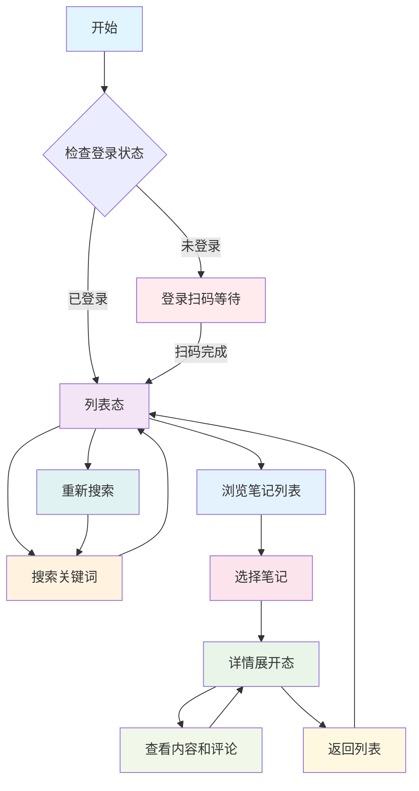
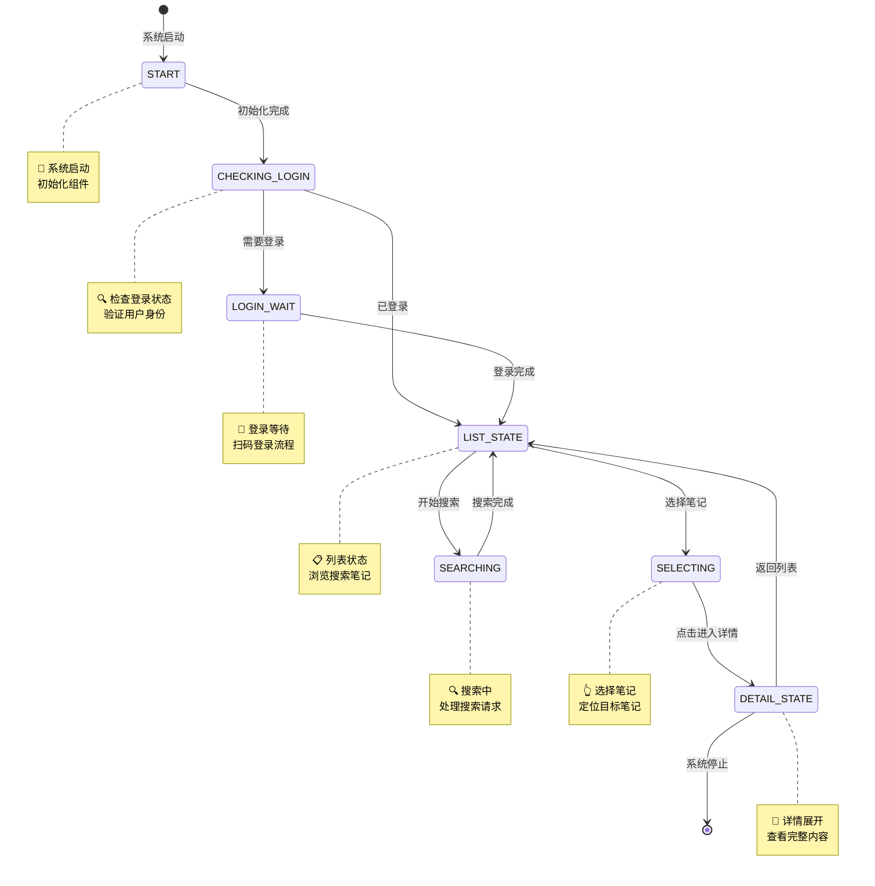
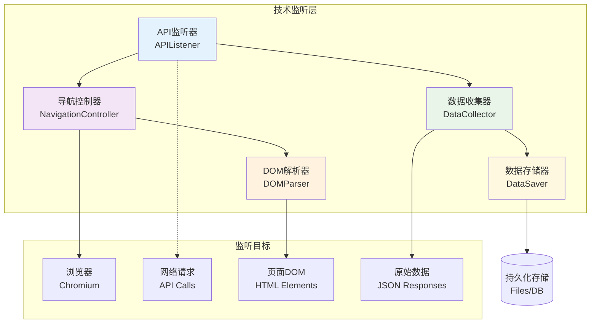
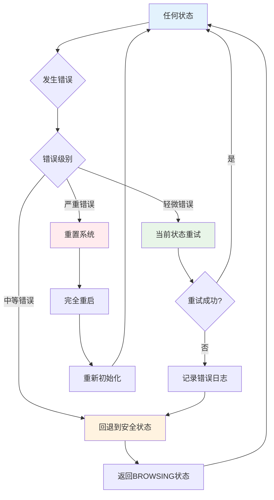
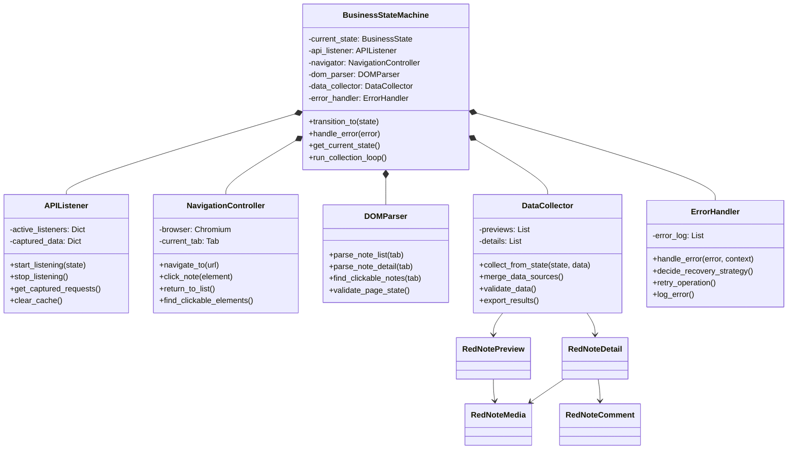
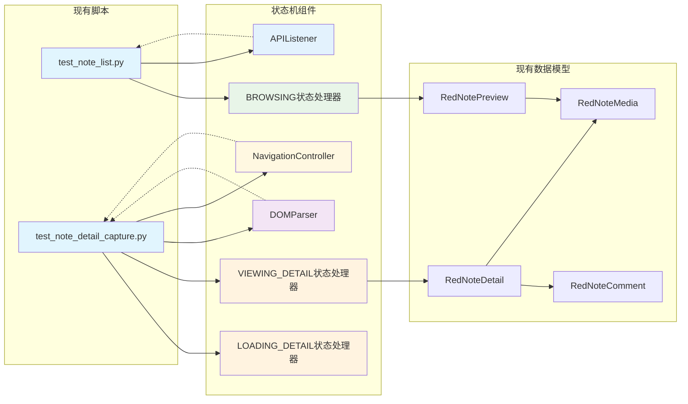
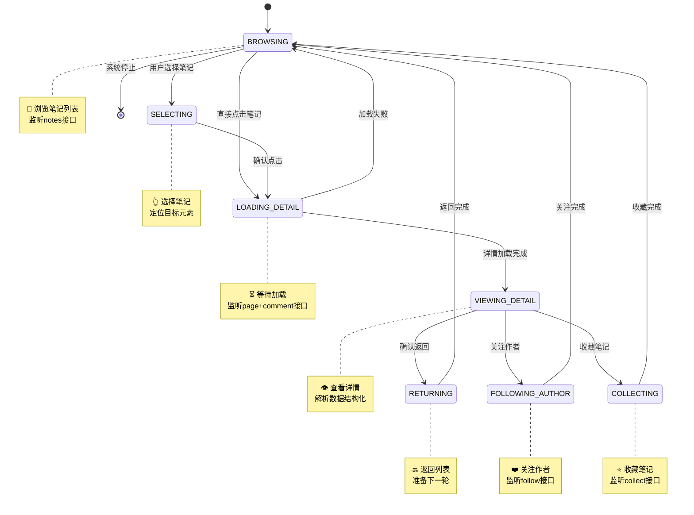
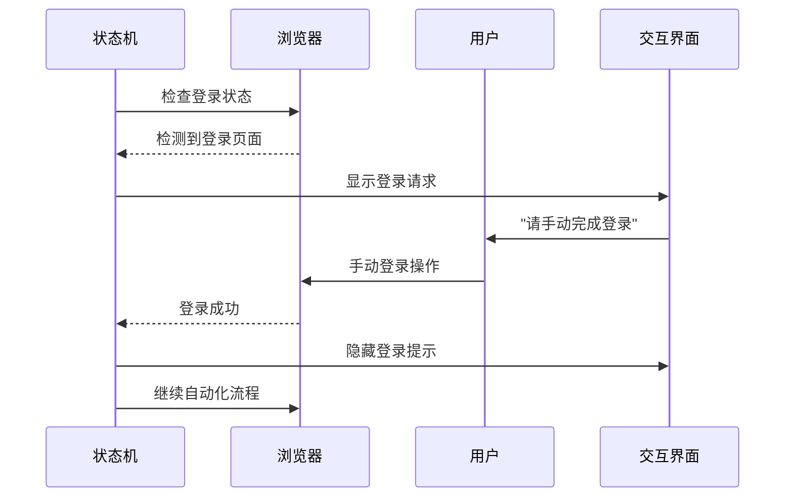
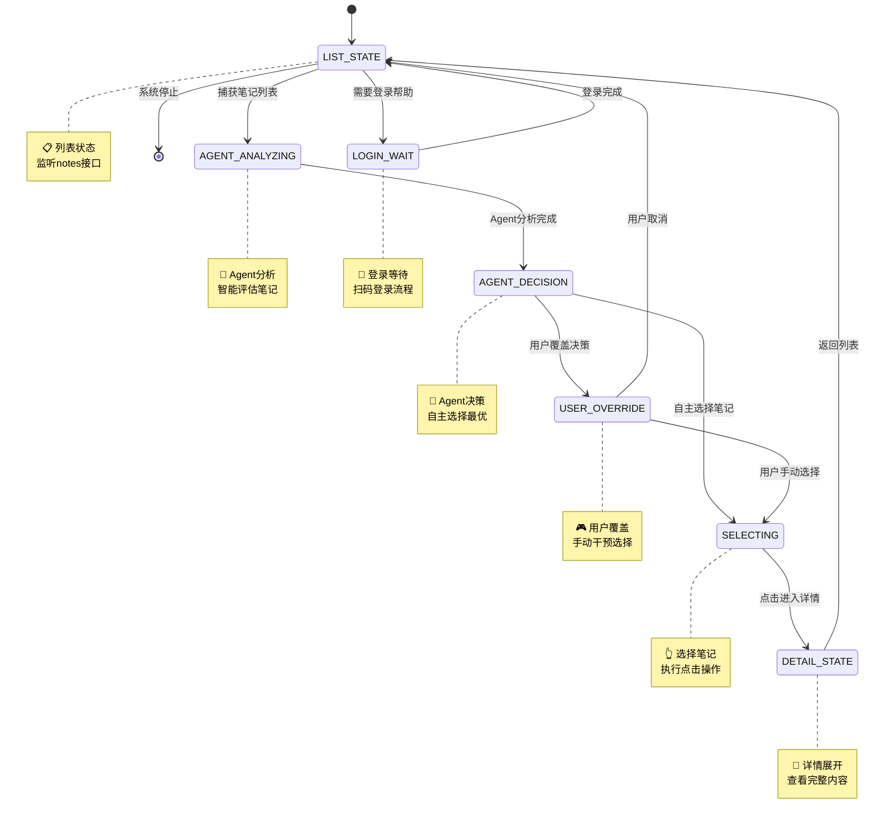
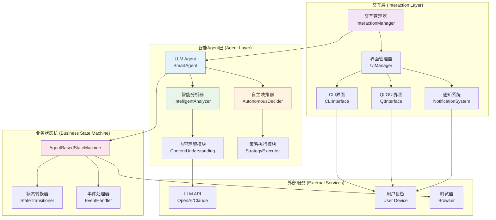

# 基于业务场景的小红书笔记采集状态机设计

## 概述

本文档描述了一个以用户操作为中心的状态机架构，用于管理小红书笔记采集系统的业务流程。整个系统围绕一个完整的用户浏览循环展开：**搜索笔记 → 点击笔记 → 查看详情 → 返回列表**。

## 核心理念

从用户行为出发设计状态，每个状态都直接反映用户的操作意图和业务场景，避免过度技术化的抽象。

## 业务流程分析

### 用户操作路径



### 关键监听接口

- **列表态**: `/api/sns/web/v1/search/notes` - 搜索和获取笔记列表
- **详情展开态**:
  - `/api/sns/web/v1/feed` - 获取笔记详情
  - `/api/sns/web/v2/comment/page` - 获取评论数据
- **登录状态**: 监听登录相关页面元素和跳转

## 业务状态定义

### 第一层：业务状态层（用户视角）



#### 状态详细说明

**🚀 START（系统启动状态）**
- **业务含义**: 系统启动时的初始状态，负责初始化所有组件
- **用户操作**: 无感知操作
- **技术动作**: 启动浏览器、加载配置、初始化数据库、检查环境
- **数据产出**: 系统初始化完成确认事件

**🔍 CHECKING_LOGIN（检查登录状态）**
- **业务含义**: 系统初始化完成后，检查用户是否已登录小红书
- **用户操作**: 无感知操作
- **技术动作**: 检查页面状态、cookie、登录令牌
- **数据产出**: 登录状态判断结果

**🔐 LOGIN_WAIT（登录扫码等待状态）**
- **业务含义**: 检测到未登录，等待用户扫码完成登录
- **用户操作**: 手机扫码、确认登录
- **技术动作**: 监听登录页面元素、检测登录成功跳转
- **数据产出**: 登录成功确认

**📋 LIST_STATE（列表状态）**
- **业务含义**: 用户在笔记列表页面，可以浏览、搜索、选择笔记
- **用户操作**: 输入搜索词、滚动浏览、筛选内容、选择笔记
- **技术动作**: 监听 search/notes 接口、解析列表数据、展示预览
- **数据产出**: RedNotePreview 列表

**🔍 SEARCHING（搜索状态）**
- **业务含义**: 正在执行搜索操作，等待搜索结果
- **用户操作**: 等待搜索完成
- **技术动作**: 发送搜索请求、监听搜索API响应
- **数据产出**: 搜索结果列表

**👆 SELECTING（选择状态）**
- **业务含义**: 用户在列表中选择特定笔记，准备点击查看详情
- **用户操作**: 鼠标悬停、定位目标笔记、点击
- **技术动作**: 定位页面元素、验证可点击性、执行点击
- **数据产出**: 目标笔记元素和位置

**📄 DETAIL_STATE（详情展开状态）**
- **业务含义**: 笔记详情页面已展开，用户可以查看完整内容和评论
- **用户操作**: 阅读内容、查看评论、滚动浏览、返回列表
- **技术动作**: 监听 feed/comment 接口、解析详情数据、结构化存储
- **数据产出**: RedNoteDetail 对象

### 第二层：技术监听层（实现支撑）



#### API监听器 (APIListener)

根据当前业务状态智能切换监听接口：

```python
STATE_API_MAPPING = {
    'LIST_STATE': ['/api/sns/web/v1/search/notes'],
    'SEARCHING': ['/api/sns/web/v1/search/notes'],
    'DETAIL_STATE': [
        '/api/sns/web/v1/feed',
        '/api/sns/web/v2/comment/page'
    ],
    'LOGIN_WAIT': [],  # 监听页面元素而非API
    'CHECKING_LOGIN': []  # 检查本地状态
}
```

#### 导航控制器 (NavigationController)

- 处理页面跳转和返回逻辑
- 模拟真实用户操作行为
- 监控页面状态变化

#### DOM解析器 (DOMParser)

- 实时解析页面结构
- 定位可点击元素
- 验证页面加载状态

### 第三层：数据处理层（数据管理）

#### 数据收集器 (DataCollector)
- 统一收集预览和详情数据
- 多源数据融合整合
- 数据质量验证

#### 数据存储器 (DataSaver)
- 持久化存储抓取数据
- 文件组织和命名管理
- 备份和恢复机制

## 状态转换逻辑

### 转换规则图

```python
STATE_TRANSITIONS = {
    'START': ['CHECKING_LOGIN'],                                 # 系统初始化完成
    'CHECKING_LOGIN': ['LOGIN_WAIT', 'LIST_STATE'],              # 检查登录状态
    'LOGIN_WAIT': ['LIST_STATE'],                                 # 登录完成后进入列表
    'LIST_STATE': ['SEARCHING', 'SELECTING', 'CHECKING_LOGIN'],  # 列表页可搜索、选择、检查登录
    'SEARCHING': ['LIST_STATE'],                                 # 搜索完成后回到列表
    'SELECTING': ['DETAIL_STATE'],                               # 选择后进入详情
    'DETAIL_STATE': ['LIST_STATE', 'CHECKING_LOGIN']             # 详情页可返回列表或检查登录状态
}
```

### 转换触发事件

| 当前状态 | 目标状态 | 触发事件 | 成功条件 | 失败处理 |
|---------|---------|----------|----------|----------|
| START | CHECKING_LOGIN | 系统初始化完成 | 所有组件就绪 | 重新初始化 |
| CHECKING_LOGIN | LOGIN_WAIT | 检测到未登录 | 发现登录页面 | 重新检查 |
| CHECKING_LOGIN | LIST_STATE | 检测到已登录 | 验证登录状态 | 进入登录等待 |
| LOGIN_WAIT | LIST_STATE | 用户扫码完成 | 检测到登录成功 | 继续等待 |
| LIST_STATE | SEARCHING | 用户搜索关键词 | 获取搜索词 | 保持列表状态 |
| LIST_STATE | SELECTING | 用户选择笔记 | 找到目标元素 | 保持浏览 |
| LIST_STATE | CHECKING_LOGIN | 检测登录失效 | 重新验证登录 | 重新检查 |
| SEARCHING | LIST_STATE | 搜索完成 | 获取笔记列表 | 搜索失败重试 |
| SELECTING | DETAIL_STATE | 点击笔记成功 | 页面跳转成功 | 重试点击 |
| DETAIL_STATE | LIST_STATE | 用户返回列表 | 回到列表页面 | 重新尝试返回 |
| DETAIL_STATE | CHECKING_LOGIN | 检测登录失效 | 详情页访问受限 | 重新检查登录 |

## 错误处理策略

### 分级错误处理

1. **轻微错误**: 当前状态重试
   - 网络波动：重新监听
   - 元素定位失败：重新查找

2. **中等错误**: 回退到安全状态
   - 页面加载超时：返回 BROWSING
   - 数据解析失败：保存部分数据

3. **严重错误**: 重置系统
   - 浏览器连接断开：重新初始化
   - 严重异常：完全重启

### 错误恢复机制



```python
ERROR_RECOVERY = {
    'network_timeout': 'retry_current_state',
    'element_not_found': 'retry_with_new_selector',
    'browser_disconnected': 'reset_to_idle',
    'critical_exception': 'shutdown_gracefully'
}
```

## 实现架构

### 核心组件



### 代码结构

```python
class BusinessStateMachine:
    """业务状态机 - 核心协调器"""
    - current_state: BusinessState
    - api_listener: APIListener
    - navigator: NavigationController
    - dom_parser: DOMParser
    - data_collector: DataCollector
    - error_handler: ErrorHandler

class APIListener:
    """API监听器 - 根据状态监听不同接口"""
    - active_listeners: Dict[str, bool]
    - captured_data: Dict[str, Any]
    - start_listening(state)
    - stop_listening()

class NavigationController:
    """导航控制器 - 模拟用户操作"""
    - browser: Chromium
    - current_tab: Tab
    - click_note(element)
    - return_to_list()

class DataCollector:
    """数据收集器 - 统一数据管理"""
    - previews: List[RedNotePreview]
    - details: List[RedNoteDetail]
    - collect_from_state(state, data)
```

## 与现有代码的整合

### 功能模块映射



### 重构策略

1. **保持兼容**: 现有测试脚本继续可用
2. **逐步迁移**: 功能逐个整合到状态机
3. **统一接口**: 提供简化的高层API
4. **向后兼容**: 支持原有的使用方式

## 使用示例

### 简单使用

```python
# 创建状态机采集器
collector = StateMachineCollector()

# 启动采集流程
collector.start_browsing(keywords=["AI", "科技"])

# 自动循环采集
collector.run_collection_loop(max_notes=10)
```

### 高级使用

```python
# 自定义状态监听
collector.add_state_listener('BROWSING', on_note_list_captured)
collector.add_state_listener('VIEWING_DETAIL', on_detail_ready)

# 错误处理配置
collector.set_error_strategy('network_timeout', 'retry_3_times')
collector.set_error_strategy('browser_crash', 'restart_browser')

# 数据输出配置
collector.set_data_output('json', 'data/notes_{date}.json')
collector.set_data_output('database', 'sqlite:///notes.db')
```

## 扩展性设计

### 新增业务场景

1. **关注作者**: 添加 `FOLLOWING_AUTHOR` 状态
2. **收藏笔记**: 添加 `COLLECTING` 状态
3. **分享内容**: 添加 `SHARING` 状态

### 新增监听接口



```python
# 扩展API监听映射
STATE_API_MAPPING['FOLLOWING_AUTHOR'] = ['/api/sns/web/v1/user/follow']
STATE_API_MAPPING['COLLECTING'] = ['/api/sns/web/v1/collect/create']
```

## 人机交互与LLM集成设计

### 交互场景分析

#### 1. 人为介入场景

**🔐 登录辅助场景**
- **触发条件**: 检测到登录页面或验证码
- **介入方式**: CLI/Web界面提示用户手动登录
- **交互流程**:


**🎯 LLM Agent决策确认**
- **触发条件**: LLM agent完成分析后提供决策建议
- **介入方式**: 展示agent的智能决策结果，用户可选择性干预
- **交互方式**:
  - CLI: 命令行选择菜单
  - Qt GUI: 图形化交互界面，实时状态展示
  - API: 异步回调通知

#### 2. LLM智能决策场景

**🤖 LLM Agent智能决策**
- **Agent特性**: 完备的自主决策能力，无需人工确认
- **评估维度**: 标题匹配度、内容相关性、互动热度、用户历史偏好
- **决策逻辑**: 批量分析 → 智能排序 → 自主推荐 → 执行最优选择
- **用户配置**: 兴趣标签、黑名单关键词、决策阈值、自动化级别
- **干预机制**: 用户可选择覆盖agent决策，但agent默认自主执行

### 扩展状态机架构

#### 带交互的状态图



#### 交互层架构



### LLM辅助决策实现

#### 数据模型扩展

```python
class RedNotePreview(BaseModel):
    # 原有字段...

    # LLM分析结果
    llm_analysis: Optional['LLMAnalysis'] = Field(None, description="LLM分析结果")

class LLMAnalysis(BaseModel):
    """LLM分析结果"""
    relevance_score: float = Field(..., ge=0, le=1, description="相关性评分 0-1")
    llm_tags: List[str] = Field(default_factory=list, description="LLM生成的标签")
    llm_summary: str = Field(default="", description="LLM生成的摘要")
    decision_reason: str = Field(default="", description="决策原因")
    analysis_time: datetime = Field(default_factory=datetime.now, description="分析时间")
```

#### LLM Agent设计

```python
class SmartAgent:
    """智能LLM Agent - 完备的自主决策能力"""

    def __init__(self, llm_client, user_config: UserConfig):
        self.llm_client = llm_client
        self.user_config = user_config
        self.analyzer = IntelligentAnalyzer(llm_client)
        self.decider = AutonomousDecider(user_config)

    async def process_and_decide(
        self,
        notes: List[RedNotePreview],
        user_context: Dict[str, Any]
    ) -> AgentDecision:
        """智能处理并自主决策"""
        # 1. 深度分析笔记
        analyses = await self.analyzer.analyze_comprehensive(notes, user_context)

        # 2. 自主决策最优选择
        decision = await self.decider.make_autonomous_decision(notes, analyses)

        # 3. 返回完备的决策结果
        return decision

class IntelligentAnalyzer:
    """智能分析器 - 深度理解内容"""

    async def analyze_comprehensive(
        self,
        notes: List[RedNotePreview],
        user_context: Dict[str, Any]
    ) -> List[LLMAnalysis]:
        """综合分析笔记内容、相关性、质量等"""
        analysis_prompt = self._build_comprehensive_prompt(notes, user_context)

        response = await self.llm_client.chat.completions.create(
            model="gpt-4",
            messages=[
                {"role": "system", "content": "你是专业的内容分析专家，具备深度理解和判断能力"},
                {"role": "user", "content": analysis_prompt}
            ],
            temperature=0.1  # 低温度保证稳定性
        )

        return self._parse_comprehensive_analysis(response.choices[0].message.content)

class AutonomousDecider:
    """自主决策器 - 无需人工确认的智能决策"""

    def __init__(self, user_config: UserConfig):
        self.config = user_config
        self.decision_threshold = user_config.decision_threshold or 0.8

    async def make_autonomous_decision(
        self,
        notes: List[RedNotePreview],
        analyses: List[LLMAnalysis]
    ) -> AgentDecision:
        """自主做出最优决策，无需人工确认"""
        # 1. 基于多维度评分排序
        scored_notes = self._calculate_comprehensive_scores(notes, analyses)

        # 2. 选择最高分的笔记
        best_note = max(scored_notes, key=lambda x: x[1])

        # 3. 确信度检查 - 如果确信度足够高，直接执行
        confidence = best_note[1]
        if confidence >= self.decision_threshold:
            return AgentDecision(
                action="auto_select",
                target_note=best_note[0],
                confidence=confidence,
                reasoning=f"Agent自主决策，确信度{confidence:.2f}",
                requires_user_confirmation=False
            )

        # 4. 如果确信度不够高，提供推荐但允许用户覆盖
        return AgentDecision(
            action="recommend",
            target_note=best_note[0],
            confidence=confidence,
            reasoning=f"Agent推荐，确信度{confidence:.2f}，建议用户确认",
            requires_user_confirmation=True
        )

@dataclass
class AgentDecision:
    """Agent决策结果"""
    action: str  # auto_select, recommend, skip
    target_note: Optional[RedNotePreview]
    confidence: float  # 0-1
    reasoning: str
    requires_user_confirmation: bool
    alternatives: List[RedNotePreview] = field(default_factory=list)
```

#### Agent驱动的业务状态机

```python
class AgentBasedStateMachine:
    """基于智能Agent的业务状态机"""

    def __init__(self, smart_agent: SmartAgent, ui_manager: UIManager):
        self.smart_agent = smart_agent
        self.ui_manager = ui_manager
        self.current_state = 'LIST_STATE'
        self.user_context = self._load_user_context()

    async def handle_list_state(self, notes: List[RedNotePreview]):
        """处理列表状态 - Agent智能分析决策"""

        # 1. Agent智能分析并自主决策
        print("🤖 Agent正在分析笔记并做出智能决策...")
        decision = await self.smart_agent.process_and_decide(
            notes, self.user_context
        )

        # 2. 根据Agent决策执行动作
        if decision.action == "auto_select":
            # Agent高确信度自主选择
            print(f"🧠 Agent自主选择: {decision.target_note.title[:30]}...")
            print(f"📊 确信度: {decision.confidence:.2f}, 原因: {decision.reasoning}")

            self.target_note = decision.target_note
            await self.transition_to('SELECTING')

        elif decision.action == "recommend":
            # Agent推荐但需要用户确认
            print(f"💡 Agent推荐: {decision.target_note.title[:30]}...")
            print(f"📊 确信度: {decision.confidence:.2f}, 建议用户确认")

            # 提供用户覆盖选项
            user_choice = await self.ui_manager.prompt_agent_decision(
                decision.target_note, decision.alternatives
            )

            if user_choice:
                self.target_note = user_choice
                await self.transition_to('SELECTING')
            else:
                await self.ui_manager.notify_user("用户跳过，继续浏览...")

        else:  # skip
            await self.ui_manager.notify_user("Agent跳过当前笔记，继续浏览...")

    async def transition_to(self, new_state: str):
        """状态转换"""
        print(f"🔄 状态转换: {self.current_state} → {new_state}")
        self.current_state = new_state
```

### 用户界面设计

#### CLI交互界面

```python
class CLIInterface:
    """命令行交互界面"""

    async def prompt_agent_decision(
        self,
        recommended_note: RedNotePreview,
        alternatives: List[RedNotePreview]
    ) -> Optional[RedNotePreview]:
        """提示Agent决策，允许用户覆盖"""
        print("\n" + "="*60)
        print("🤖 Agent智能决策结果:")
        print("="*60)

        # 显示推荐笔记
        print(f"\n🎯 Agent推荐笔记:")
        print(f"   📝 {recommended_note.title}")
        print(f"   👤 作者: {recommended_note.author_name}")
        print(f"   🔥 互动: {recommended_note.interaction.like_count}赞 {recommended_note.interaction.comment_count}评")

        if alternatives:
            print(f"\n🔄 备选方案:")
            for i, alt in enumerate(alternatives[:2], 1):
                print(f"   {i}. {alt.title[:40]}... ({alt.interaction.like_count}赞)")

        print(f"\n选项:")
        print(f"   1. ✅ 接受Agent推荐")
        if alternatives:
            print(f"   2. 🔄 选择备选方案")
            print(f"   3. ⏭️ 跳过当前笔记")
        else:
            print(f"   2. ⏭️ 跳过当前笔记")

        choice = input("\n请选择 (默认接受推荐): ").strip() or "1"

        if choice == "1":
            return recommended_note
        elif choice == "2" and alternatives:
            return alternatives[0]  # 选择第一个备选
        else:
            return None

    async def prompt_login_assistance(self) -> bool:
        """提示登录协助"""
        print("\n" + "🔐 检测到需要登录")
        print("请在浏览器中完成登录操作")
        print("登录完成后按 Enter 继续...")
        input()
        return True

    async def notify_user(self, message: str):
        """通知用户消息"""
        print(f"\n💬 {message}")
```

#### Qt GUI交互界面

```python
from PyQt6.QtWidgets import *
from PyQt6.QtCore import *
from PyQt6.QtGui import *
import asyncio

class QtInterface(QMainWindow):
    """Qt图形化交互界面"""

    def __init__(self, state_machine):
        super().__init__()
        self.state_machine = state_machine
        self.setup_ui()

    def setup_ui(self):
        """设置UI界面"""
        self.setWindowTitle("小红书智能采集助手")
        self.setGeometry(100, 100, 1200, 800)

        # 创建主布局
        central_widget = QWidget()
        self.setCentralWidget(central_widget)
        layout = QVBoxLayout(central_widget)

        # 状态显示区域
        self.status_widget = self.create_status_widget()
        layout.addWidget(self.status_widget)

        # Agent决策显示区域
        self.agent_widget = self.create_agent_widget()
        layout.addWidget(self.agent_widget)

        # 笔记列表显示区域
        self.notes_widget = self.create_notes_widget()
        layout.addWidget(self.notes_widget)

        # 控制按钮区域
        self.control_widget = self.create_control_widget()
        layout.addWidget(self.control_widget)

    def create_status_widget(self):
        """创建状态显示组件"""
        widget = QGroupBox("系统状态")
        layout = QVBoxLayout()

        self.current_state_label = QLabel("当前状态: 初始化中...")
        self.agent_status_label = QLabel("Agent状态: 待机")
        self.browser_status_label = QLabel("浏览器状态: 未连接")

        layout.addWidget(self.current_state_label)
        layout.addWidget(self.agent_status_label)
        layout.addWidget(self.browser_status_label)

        widget.setLayout(layout)
        return widget

    def create_agent_widget(self):
        """创建Agent决策显示组件"""
        widget = QGroupBox("Agent智能决策")
        layout = QVBoxLayout()

        self.decision_text = QTextEdit()
        self.decision_text.setMaximumHeight(150)
        self.decision_text.setPlaceholderText("Agent决策信息将在此显示...")

        self.confidence_bar = QProgressBar()
        self.confidence_bar.setRange(0, 100)
        self.confidence_bar.setValue(0)

        layout.addWidget(QLabel("决策分析:"))
        layout.addWidget(self.decision_text)
        layout.addWidget(QLabel("确信度:"))
        layout.addWidget(self.confidence_bar)

        widget.setLayout(layout)
        return widget

    def create_notes_widget(self):
        """创建笔记列表显示组件"""
        widget = QGroupBox("笔记列表")
        layout = QVBoxLayout()

        self.notes_table = QTableWidget()
        self.notes_table.setColumnCount(6)
        self.notes_table.setHorizontalHeaderLabels([
            "标题", "作者", "点赞数", "评论数", "相关性", "状态"
        ])

        # 设置表格属性
        self.notes_table.setSelectionBehavior(QAbstractItemView.SelectionBehavior.SelectRows)
        self.notes_table.setEditTriggers(QAbstractItemView.EditTrigger.NoEditTriggers)

        layout.addWidget(self.notes_table)
        widget.setLayout(layout)
        return widget

    def create_control_widget(self):
        """创建控制按钮组件"""
        widget = QGroupBox("控制面板")
        layout = QHBoxLayout()

        self.start_btn = QPushButton("开始采集")
        self.pause_btn = QPushButton("暂停")
        self.stop_btn = QPushButton("停止")
        self.override_btn = QPushButton("覆盖Agent决策")

        self.start_btn.clicked.connect(self.start_collection)
        self.pause_btn.clicked.connect(self.pause_collection)
        self.stop_btn.clicked.connect(self.stop_collection)
        self.override_btn.clicked.connect(self.override_agent_decision)

        layout.addWidget(self.start_btn)
        layout.addWidget(self.pause_btn)
        layout.addWidget(self.stop_btn)
        layout.addWidget(self.override_btn)

        widget.setLayout(layout)
        return widget

    def update_agent_decision(self, decision: AgentDecision):
        """更新Agent决策显示"""
        # 更新决策文本
        self.decision_text.setText(f"决策: {decision.action}\n原因: {decision.reasoning}")

        # 更新确信度条
        confidence_percent = int(decision.confidence * 100)
        self.confidence_bar.setValue(confidence_percent)

        # 更新Agent状态
        self.agent_status_label.setText(f"Agent状态: {decision.action}")

    def update_notes_table(self, notes: List[RedNotePreview], analyses: List[LLMAnalysis] = None):
        """更新笔记表格"""
        self.notes_table.setRowCount(len(notes))

        for row, note in enumerate(notes):
            self.notes_table.setItem(row, 0, QTableWidgetItem(note.title[:30] + "..."))
            self.notes_table.setItem(row, 1, QTableWidgetItem(note.author_name))
            self.notes_table.setItem(row, 2, QTableWidgetItem(str(note.interaction.like_count)))
            self.notes_table.setItem(row, 3, QTableWidgetItem(str(note.interaction.comment_count)))

            if analyses and row < len(analyses):
                relevance = f"{analyses[row].relevance_score:.2f}"
                self.notes_table.setItem(row, 4, QTableWidgetItem(relevance))

            self.notes_table.setItem(row, 5, QTableWidgetItem("待分析"))

    async def prompt_agent_decision(self, decision: AgentDecision) -> Optional[RedNotePreview]:
        """在Qt界面中提示Agent决策"""
        msg_box = QMessageBox()
        msg_box.setWindowTitle("Agent决策确认")
        msg_box.setText(f"Agent推荐: {decision.target_note.title[:50]}...")
        msg_box.setInformativeText(f"确信度: {decision.confidence:.2f}\n原因: {decision.reasoning}")

        msg_box.setStandardButtons(
            QMessageBox.StandardButton.Yes |
            QMessageBox.StandardButton.No
        )
        msg_box.setDefaultButton(QMessageBox.StandardButton.Yes)

        if msg_box.exec() == QMessageBox.StandardButton.Yes:
            return decision.target_note
        return None

# 异步Qt集成
class AsyncQtIntegration:
    """异步Qt集成器"""

    def __init__(self, qt_interface):
        self.qt_interface = qt_interface
        self.loop = None

    def setup_async_loop(self):
        """设置异步事件循环"""
        self.loop = QEventLoop()
        QTimer.singleShot(0, self.loop.quit)
        self.loop.exec()

    def run_in_thread(self, coro):
        """在线程中运行协程"""
        def worker():
            new_loop = asyncio.new_event_loop()
            asyncio.set_event_loop(new_loop)
            return new_loop.run_until_complete(coro)

        thread = QThread.create(worker)
        return thread
```

### 配置管理

#### 用户配置文件

```python
@dataclass
class UserConfig:
    """用户配置"""
    # LLM配置
    llm_provider: str = "openai"
    llm_model: str = "gpt-4"
    llm_api_key: str = ""

    # Agent决策配置
    decision_threshold: float = 0.8  # Agent自主决策的阈值
    auto_execution_enabled: bool = True  # 是否允许Agent自动执行
    max_notes_per_batch: int = 10

    # 兴趣配置
    interest_tags: List[str] = field(default_factory=lambda: ["AI", "科技", "编程"])
    blacklist_keywords: List[str] = field(default_factory=list)
    user_preferences: Dict[str, Any] = field(default_factory=dict)

    # 交互配置
    interface_type: str = "cli"  # cli, qt, web
    notification_enabled: bool = True
    show_agent_reasoning: bool = True

    # 浏览器配置
    headless: bool = False
    browser_port: int = 9933

    # Agent行为配置
    agent_temperature: float = 0.1  # Agent决策的稳定性
    learning_enabled: bool = True  # 是否启用Agent学习
    risk_tolerance: str = "medium"  # low, medium, high
```

### 使用示例

#### 启动Agent驱动的智能采集器

```python
async def main():
    # 1. 加载用户配置
    config = UserConfig.from_file("config/user_config.json")

    # 2. 初始化LLM客户端
    llm_client = OpenAI(api_key=config.llm_api_key)

    # 3. 创建智能Agent
    smart_agent = SmartAgent(llm_client, config)

    # 4. 初始化用户界面
    if config.interface_type == "qt":
        from PyQt6.QtWidgets import QApplication
        app = QApplication(sys.argv)
        qt_interface = QtInterface(None)
        ui_manager = UIManager(qt_interface=qt_interface)
        qt_interface.show()
    elif config.interface_type == "web":
        ui_manager = UIManager(web_interface=WebInterface(port=8080))
    else:  # cli
        ui_manager = UIManager(cli_interface=CLIInterface())

    # 5. 创建Agent驱动的状态机
    collector = AgentBasedStateMachine(
        smart_agent=smart_agent,
        ui_manager=ui_manager
    )

    # 6. 启动智能采集流程
    await collector.start_intelligent_collection(
        keywords=["人工智能", "机器学习", "科技前沿"],
        max_notes=100,
        auto_mode=config.auto_execution_enabled
    )

if __name__ == "__main__":
    asyncio.run(main())
```

#### CLI快速启动示例

```bash
# 基础CLI模式
python -m mao_see_see.agent_collector --interface cli --keywords "AI,科技" --auto

# Qt GUI模式
python -m mao_see_see.agent_collector --interface qt --keywords "AI,科技" --gui

# 高级配置模式
python -m mao_see_see.agent_collector \
    --config config/user_config.json \
    --interface qt \
    --threshold 0.85 \
    --auto-execute \
    --learning-enabled
```

## 总结

### 核心设计理念

这个基于业务场景的状态机设计体现了以下关键理念：

1. **三态清晰模型**: 列表态、详情展开态、登录扫码等待状态，精准对应小红书网页的实际用户体验
2. **Agent驱动智能**: 完备的LLM Agent具备自主决策能力，无需人工确认即可执行最优选择
3. **用户可控干预**: Agent默认自主执行，但用户可随时覆盖决策，保持人机协同的最佳平衡

### 技术架构优势

1. **业务清晰**: 状态直接反映用户操作，代码逻辑一目了然
2. **精准监听**: 按需监听不同API接口，避免资源浪费
3. **易于扩展**: 新增业务场景只需添加对应状态
4. **维护简单**: 状态转换规则明确，调试方便
5. **向后兼容**: 现有功能可无缝整合

### 智能化特性

6. **智能决策**: LLM Agent具备深度内容理解和自主决策能力
7. **自适应学习**: Agent可根据用户历史偏好持续优化决策质量
8. **确信度机制**: 基于阈值的自动/推荐决策模式，平衡效率与准确性

### 交互灵活性

9. **多界面支持**: CLI、Qt GUI、Web三种交互方式适应不同使用场景
10. **实时状态展示**: Qt界面提供状态机实时监控和Agent决策可视化
11. **丰富配置**: 决策阈值、风险偏好、自动化级别等全面可配置

### 实用价值

通过这个设计，我们可以将现有的分散功能重组成一个统一、清晰、可维护、具备智能决策能力的现代化业务系统。状态机不仅处理技术层面的浏览器操作，更重要的是集成了人工智能和人性化交互，实现了真正的智能化内容采集助手。

**Agent完备性**是设计的核心亮点 - 系统默认可以完全自主运行，用户干预只是增强选项而非必需功能，这满足了从初学者到专业用户的不同需求层次。