# 小红书笔记采集状态机 - 模块架构详解

## 1. 整体架构概览

### 核心设计理念

这个状态机设计采用**分层协作架构**，将复杂的网页采集任务分解为多个独立但协调工作的模块。每个模块专注于特定的职责，通过清晰的接口进行协作。

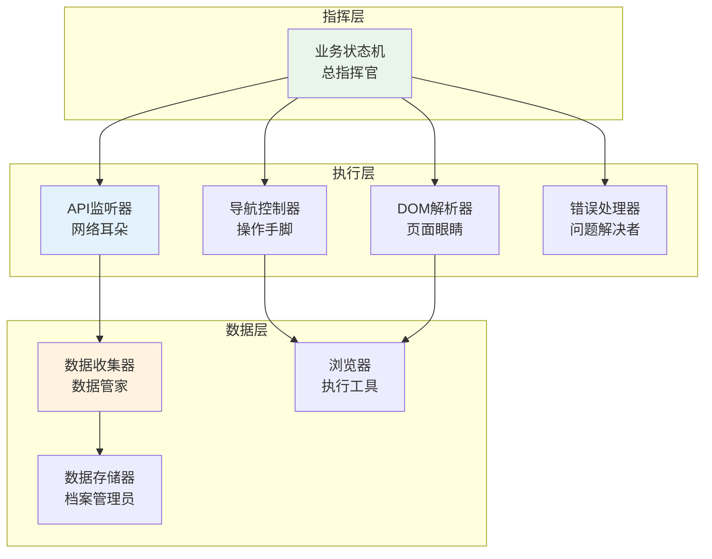

### 三种核心状态

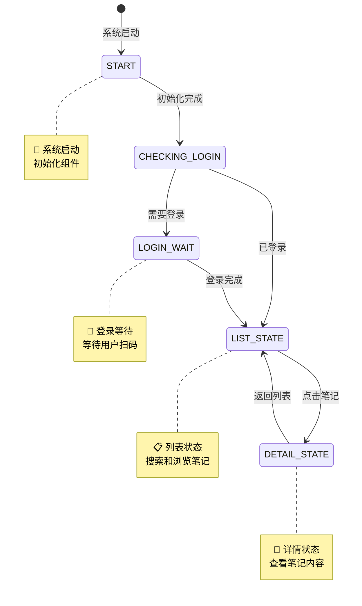

## 2. 核心模块详解

### 2.1 事件驱动的业务状态机 (EventDrivenStateMachine) - 大脑中枢

**角色定位**: 事件驱动的总指挥官，负责接收事件、分析事件、决策行动并发布响应事件

**核心职责**:
- 维护当前系统状态，基于事件进行状态转换
- 接收和分析各类业务事件，做出智能决策
- 协调各个执行模块，通过事件进行通信
- 处理异常情况，发布恢复事件

**事件驱动的工作原理**:
```python
# 事件驱动状态机的核心工作方式
class EventDrivenStateMachine:
    def __init__(self):
        self.current_state = "CHECKING_LOGIN"
        self.event_queue = asyncio.Queue()  # 事件队列
        self.state_handlers = {
            "LIST_STATE": ListStateHandler(),
            "DETAIL_STATE": DetailStateHandler(),
            "LOGIN_WAIT": LoginWaitHandler()
        }

    async def run(self):
        """事件驱动的主循环 - 阻塞等待事件，零CPU空转"""
        while self.running:
            # 阻塞等待下一个事件
            event = await self.event_queue.get()
            await self.handle_event(event)

    async def handle_event(self, event):
        """处理事件并可能触发状态转换"""
        # 获取当前状态处理器
        handler = self.state_handlers[self.current_state]

        # 让状态处理器处理事件
        new_state = await handler.process_event(event, self.current_state)

        # 如果需要状态转换
        if new_state and new_state != self.current_state:
            await self.transition_to(new_state)
```

**基于事件的协作模式**:
- **接收事件**: 监听来自各模块的业务事件（API响应、用户操作、页面变化等）
- **发布事件**: 向相关模块发布指令事件（执行搜索、点击笔记、收集数据等）
- **状态转换**: 基于事件内容决定是否需要状态转换
- **异常处理**: 接收错误事件，发布恢复指令事件

**事件驱动的决策流程**:
```python
# 状态机的智能决策示例
async def process_search_results_event(self, event):
    """处理搜索结果事件的决策流程"""

    notes = event.data["notes"]

    # 发布分析事件给AI Agent
    await self.emit_event("ANALYZE_SEARCH_RESULTS", {
        "notes": notes,
        "context": self.get_user_context()
    })

    # 等待Agent的分析结果事件
    analysis_result = await self.wait_for_event("ANALYSIS_COMPLETED", timeout=5.0)

    # 基于分析结果决策
    if analysis_result.confidence >= 0.8:
        # 高置信度，自动选择
        await self.emit_event("AUTO_SELECT_NOTE", {
            "note": analysis_result.selected_note
        })
    else:
        # 低置信度，请求用户确认
        await self.emit_event("REQUEST_USER_CONFIRMATION", {
            "recommendations": analysis_result.top_notes
        })
```

### 2.2 事件驱动的API监听器 (APIListener) - 网络事件发射器

**角色定位**: 专门监听网络请求并发布相应事件的"网络事件发射器"

**核心职责**:
- 监听浏览器的网络请求，捕获API调用
- 将API响应转换为业务事件并发布到事件总线
- 根据当前状态智能过滤相关API请求
- 处理网络错误并发布错误事件

**事件驱动的监听机制**:
```python
# 不同状态触发不同的事件类型
STATE_EVENT_MAPPING = {
    "LIST_STATE": {
        "/api/sns/web/v1/search/notes": "SEARCH_API_RESPONSE",  # 搜索结果事件
    },
    "DETAIL_STATE": {
        "/api/sns/web/v1/feed": "DETAIL_API_RESPONSE",       # 详情数据事件
        "/api/sns/web/v2/comment/page": "COMMENT_API_RESPONSE" # 评论数据事件
    },
    "LOGIN_WAIT": {
        "page_load": "LOGIN_PAGE_DETECTED"  # 登录页面检测事件
    }
}
```

**事件驱动的工作流程**:
```python
class EventDrivenAPIListener:
    """事件驱动的API监听器"""

    def __init__(self, event_bus):
        self.event_bus = event_bus
        self.current_state = None
        self.network_monitor = NetworkMonitor()

    async def start_monitoring(self, state):
        """根据状态启动对应的事件监听"""
        self.current_state = state

        # 设置API过滤器
        target_apis = self.get_target_apis(state)
        await self.network_monitor.set_filter(target_apis)

        # 开始监听网络请求
        await self.network_monitor.start()

    async def on_api_response(self, api_data):
        """API响应时发布对应事件"""
        # 确定事件类型
        event_type = self.determine_event_type(api_data)

        # 发布事件到总线
        await self.event_bus.publish(Event(
            type=event_type,
            data={
                "api_url": api_data["url"],
                "response_data": api_data["response"],
                "status_code": api_data["status_code"],
                "timestamp": time.time(),
                "state": self.current_state
            }
        ))

    async def on_api_error(self, error_data):
        """API错误时发布错误事件"""
        await self.event_bus.publish(Event(
            type="API_ERROR",
            data={
                "error_type": error_data["error_type"],
                "error_message": error_data["message"],
                "api_url": error_data.get("url"),
                "retry_count": error_data.get("retry_count", 0)
            }
        ))

    def determine_event_type(self, api_data):
        """根据API数据确定事件类型"""
        url = api_data["url"]
        state_mapping = STATE_EVENT_MAPPING.get(self.current_state, {})

        for api_pattern, event_type in state_mapping.items():
            if api_pattern in url:
                return event_type

        return "UNKNOWN_API_RESPONSE"
```

### 2.3 事件驱动的导航控制器 (NavigationController) - 事件执行器

**角色定位**: 接收指令事件并执行浏览器操作的"事件执行器"

**核心职责**:
- 订阅指令事件并执行相应的浏览器操作
- 模拟真实的用户操作行为
- 监控页面变化并发布导航事件
- 定位页面可交互元素并执行交互

**事件驱动的操作执行**:
```python
class EventDrivenNavigationController:
    """事件驱动的导航控制器"""

    def __init__(self, event_bus, browser):
        self.event_bus = event_bus
        self.browser = browser
        self.current_tab = None

    async def start(self):
        """启动导航控制器并订阅事件"""
        # 订阅指令事件
        await self.event_bus.subscribe("EXECUTE_SEARCH", self.handle_search_event)
        await self.event_bus.subscribe("CLICK_NOTE", self.handle_click_note_event)
        await self.event_bus.subscribe("RETURN_TO_LIST", self.handle_return_event)
        await self.event_bus.subscribe("SCROLL_PAGE", self.handle_scroll_event)

    async def handle_search_event(self, event):
        """处理搜索事件"""
        keyword = event.data["keyword"]

        try:
            # 执行搜索操作
            await self.execute_search(keyword)

            # 发布搜索完成事件
            await self.event_bus.publish(Event(
                type="SEARCH_COMPLETED",
                data={
                    "keyword": keyword,
                    "timestamp": time.time()
                }
            ))

        except Exception as e:
            # 发布搜索失败事件
            await self.event_bus.publish(Event(
                type="SEARCH_FAILED",
                data={
                    "keyword": keyword,
                    "error": str(e),
                    "timestamp": time.time()
                }
            ))

    async def handle_click_note_event(self, event):
        """处理点击笔记事件"""
        note_element = event.data["note_element"]

        try:
            # 执行点击操作
            await self.click_element(note_element)

            # 监听页面跳转
            new_url = await self.wait_for_page_change()

            # 发布页面跳转事件
            await self.event_bus.publish(Event(
                type="PAGE_CHANGED",
                data={
                    "new_url": new_url,
                    "action": "note_clicked",
                    "note_id": event.data.get("note_id"),
                    "timestamp": time.time()
                }
            ))

        except Exception as e:
            # 发布点击失败事件
            await self.event_bus.publish(Event(
                type="CLICK_FAILED",
                data={
                    "target_element": note_element,
                    "error": str(e),
                    "timestamp": time.time()
                }
            ))

    async def execute_search(self, keyword):
        """执行搜索操作的具体步骤"""
        # 1. 找到搜索框
        search_box = await self.find_element("#search-input")
        # 2. 输入关键词
        await search_box.clear()
        await search_box.type(keyword)
        # 3. 点击搜索按钮
        search_button = await self.find_element(".search-btn")
        await search_button.click()

    async def wait_for_page_change(self, timeout=10.0):
        """等待页面变化并返回新URL"""
        current_url = await self.browser.current_url

        start_time = time.time()
        while time.time() - start_time < timeout:
            new_url = await self.browser.current_url
            if new_url != current_url:
                return new_url
            await asyncio.sleep(0.1)

        return current_url  # 超时返回原URL
```

**与事件系统的协作模式**:
- **订阅指令事件**: `EXECUTE_SEARCH`, `CLICK_NOTE`, `RETURN_TO_LIST` 等
- **发布结果事件**: `SEARCH_COMPLETED`, `PAGE_CHANGED`, `NAVIGATION_SUCCESS` 等
- **错误处理**: 发布 `SEARCH_FAILED`, `CLICK_FAILED` 等错误事件
- **状态反馈**: 通过事件总线向状态机报告导航结果

### 2.4 事件驱动的数据收集器 (DataCollector) - 数据事件处理器

**角色定位**: 订阅数据事件并处理收集的"数据事件处理器"

**核心职责**:
- 订阅数据相关事件（API数据、验证结果、转换完成等）
- 解析、验证和结构化数据
- 数据质量检查和错误修复
- 发布数据处理完成事件供存储器订阅

**事件驱动的数据收集流程**:
```python
class EventDrivenDataCollector:
    """事件驱动的数据收集器"""

    def __init__(self, event_bus):
        self.event_bus = event_bus
        self.processed_data = {}

    async def start(self):
        """启动数据收集器并订阅相关事件"""
        # 订阅数据事件
        await self.event_bus.subscribe("SEARCH_API_RESPONSE", self.handle_search_data_event)
        await self.event_bus.subscribe("DETAIL_API_RESPONSE", self.handle_detail_data_event)
        await self.event_bus.subscribe("COMMENT_API_RESPONSE", self.handle_comment_data_event)
        await self.event_bus.subscribe("DATA_VALIDATION_REQUIRED", self.handle_validation_event)
        await self.event_bus.subscribe("DATA_REPAIR_REQUIRED", self.handle_repair_event)

    async def handle_search_data_event(self, event):
        """处理搜索数据事件"""
        raw_data = event.data["response_data"]

        try:
            # 解析搜索结果
            notes = await self.parse_note_list(raw_data)

            # 发布数据验证事件
            await self.event_bus.publish(Event(
                type="DATA_VALIDATION_REQUIRED",
                data={
                    "data_type": "search_results",
                    "raw_data": notes,
                    "source_event": event
                }
            ))

        except Exception as e:
            # 发布数据解析错误事件
            await self.event_bus.publish(Event(
                type="DATA_PARSING_ERROR",
                data={
                    "data_type": "search_results",
                    "error": str(e),
                    "source_event": event
                }
            ))

    async def handle_validation_event(self, event):
        """处理数据验证事件"""
        data = event.data["raw_data"]
        data_type = event.data["data_type"]

        try:
            # 执行数据验证
            validation_result = await self.validate_data(data, data_type)

            if validation_result.is_valid:
                # 数据验证通过，发布转换事件
                await self.event_bus.publish(Event(
                    type="DATA_VALIDATION_PASSED",
                    data={
                        "data_type": data_type,
                        "validated_data": data,
                        "quality_score": validation_result.score
                    }
                ))
            else:
                # 数据验证失败，发布修复事件
                await self.event_bus.publish(Event(
                    type="DATA_REPAIR_REQUIRED",
                    data={
                        "data_type": data_type,
                        "invalid_data": data,
                        "validation_errors": validation_result.errors,
                        "source_event": event
                    }
                ))

        except Exception as e:
            # 验证过程出错
            await self.event_bus.publish(Event(
                type="VALIDATION_PROCESSING_ERROR",
                data={
                    "data_type": data_type,
                    "error": str(e),
                    "source_event": event
                }
            ))

    async def process_validated_data(self, validated_data, data_type):
        """处理验证通过的数据"""
        try:
            # 转换为业务对象
            if data_type == "search_results":
                business_objects = await self.convert_to_previews(validated_data)
            elif data_type == "note_detail":
                business_objects = await self.convert_to_detail(validated_data)
            elif data_type == "comments":
                business_objects = await self.convert_to_comments(validated_data)

            # 发布数据处理完成事件
            await self.event_bus.publish(Event(
                type="DATA_PROCESSING_COMPLETED",
                data={
                    "data_type": data_type,
                    "business_objects": business_objects,
                    "processed_count": len(business_objects),
                    "timestamp": time.time()
                }
            ))

        except Exception as e:
            await self.event_bus.publish(Event(
                type="DATA_PROCESSING_ERROR",
                data={
                    "data_type": data_type,
                    "error": str(e)
                }
            ))
```

**事件驱动的数据流程示例**:
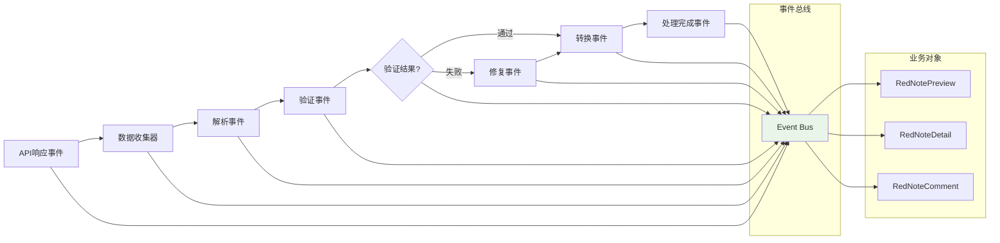

### 2.5 事件驱动的错误处理器 (ErrorHandler) - 错误事件处理器

**角色定位**: 订阅错误事件并处理恢复策略的"错误事件处理器"

**核心职责**:
- 订阅各类错误事件（网络错误、解析错误、系统错误等）
- 分析和分类错误类型和严重程度
- 基于事件内容决定错误恢复策略
- 发布恢复指令事件和状态重置事件
- 记录错误日志和监控指标

**事件驱动的错误处理策略**:
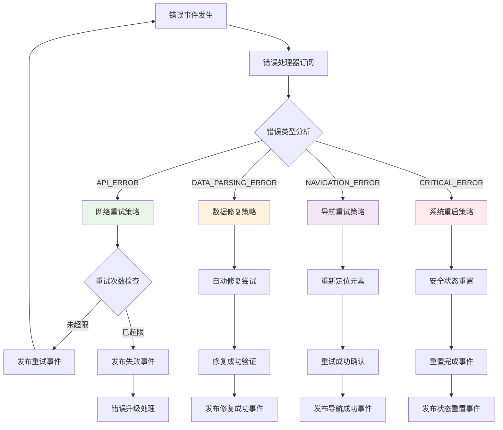

**事件驱动的错误处理流程**:
```python
class EventDrivenErrorHandler:
    """事件驱动的错误处理器"""

    def __init__(self, event_bus):
        self.event_bus = event_bus
        self.error_statistics = {}
        self.retry_policies = {
            "network": {"max_retries": 3, "backoff_factor": 2},
            "parsing": {"max_retries": 2, "auto_repair": True},
            "navigation": {"max_retries": 5, "retry_delay": 1.0}
        }

    async def start(self):
        """启动错误处理器并订阅错误事件"""
        # 订阅各种错误事件
        await self.event_bus.subscribe("API_ERROR", self.handle_api_error_event)
        await self.event_bus.subscribe("DATA_PARSING_ERROR", self.handle_parsing_error_event)
        await self.event_bus.subscribe("NAVIGATION_ERROR", self.handle_navigation_error_event)
        await self.event_bus.subscribe("CLICK_FAILED", self.handle_click_error_event)
        await self.event_bus.subscribe("SEARCH_FAILED", self.handle_search_error_event)

    async def handle_api_error_event(self, event):
        """处理API错误事件"""
        error_data = event.data
        retry_count = error_data.get("retry_count", 0)
        max_retries = self.retry_policies["network"]["max_retries"]

        if retry_count < max_retries:
            # 发布重试事件
            backoff_delay = self.retry_policies["network"]["backoff_factor"] ** retry_count
            await asyncio.sleep(backoff_delay)

            await self.event_bus.publish(Event(
                type="RETRY_API_REQUEST",
                data={
                    "original_request": error_data["original_request"],
                    "retry_count": retry_count + 1,
                    "delay": backoff_delay,
                    "source_error_event": event
                }
            ))

            # 记录重试统计
            self.record_error_statistic("network", "retry")
        else:
            # 超过重试次数，发布失败事件
            await self.event_bus.publish(Event(
                type="API_RETRY_EXHAUSTED",
                data={
                    "final_error": error_data,
                    "total_retries": retry_count,
                    "source_error_event": event
                }
            ))

    async def handle_parsing_error_event(self, event):
        """处理数据解析错误事件"""
        error_data = event.data
        data_type = error_data.get("data_type", "unknown")

        if self.retry_policies["parsing"]["auto_repair"]:
            # 尝试自动修复
            try:
                repaired_data = await self.attempt_data_repair(error_data["invalid_data"], data_type)

                if repaired_data:
                    # 发布修复成功事件
                    await self.event_bus.publish(Event(
                        type="DATA_AUTO_REPAIRED",
                        data={
                            "data_type": data_type,
                            "repaired_data": repaired_data,
                            "original_error_event": event
                        }
                    ))
                else:
                    # 修复失败，发布修复失败事件
                    await self.event_bus.publish(Event(
                        type="DATA_REPAIR_FAILED",
                        data={
                            "data_type": data_type,
                            "error_details": error_data,
                            "source_error_event": event
                        }
                    ))
            except Exception as e:
                # 修复过程出错
                await self.event_bus.publish(Event(
                    type="DATA_REPAIR_PROCESSING_ERROR",
                    data={
                        "data_type": data_type,
                        "repair_error": str(e),
                        "original_error_event": event
                    }
                ))
        else:
            # 不支持自动修复，直接发布失败事件
            await self.event_bus.publish(Event(
                type="DATA_PARSING_FAILED",
                data={
                    "data_type": data_type,
                    "error_details": error_data,
                    "source_error_event": event
                }
            ))

    def record_error_statistic(self, error_type, action):
        """记录错误统计"""
        if error_type not in self.error_statistics:
            self.error_statistics[error_type] = {
                "total_count": 0,
                "retry_count": 0,
                "fail_count": 0,
                "recovery_count": 0
            }

        self.error_statistics[error_type][f"{action}_count"] += 1

    async def get_error_statistics(self):
        """获取错误统计信息"""
        return self.error_statistics
```

**错误事件的发布策略**:
- **错误检测事件**: 模块在检测到错误时发布相应的错误事件
- **错误处理事件**: 错误处理器订阅并处理错误事件，发布恢复事件
- **恢复事件**: 其他模块订阅恢复事件并执行相应的恢复操作
- **状态重置事件**: 错误严重时发布状态重置事件，系统恢复到安全状态

## 3. 事件驱动架构 - 系统的核心推进力

### 3.1 架构理念：从轮询到响应

传统的"心跳驱动"架构存在资源浪费和响应延迟的问题。我们采用**事件驱动为主，心跳监控为辅**的现代化架构：

- **事件驱动**：系统只在有意义的事件发生时才被唤醒，实现零CPU空转
- **即时响应**：事件触发立即处理，无延迟等待
- **弱心跳**：低频健康监控，不影响主要业务流程

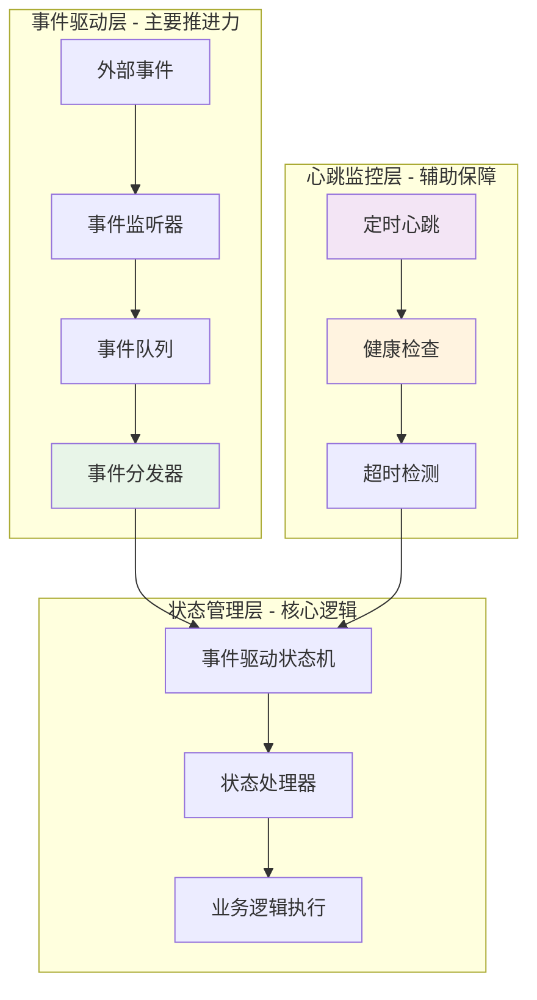

### 3.2 事件驱动的核心状态机

**主状态机架构**：

```python
class EventDrivenStateMachine:
    """事件驱动的核心状态机"""

    def __init__(self):
        self.current_state = "CHECKING_LOGIN"
        self.event_queue = asyncio.Queue()
        self.state_handlers = {
            "LIST_STATE": ListStateHandler(),
            "DETAIL_STATE": DetailStateHandler(),
            "LOGIN_WAIT": LoginWaitHandler()
        }
        self.last_activity = time.time()

    async def run(self):
        """事件驱动的主循环 - 阻塞等待，高响应性"""
        tasks = [
            self.process_events(),      # 主要：事件处理
            self.monitor_health(),      # 辅助：健康检查
            self.monitor_timeouts()     # 辅助：超时监控
        ]
        await asyncio.gather(*tasks)

    async def process_events(self):
        """事件驱动的核心 - 阻塞等待事件，零CPU空转"""
        while self.running:
            # 阻塞等待事件，不空转CPU
            event = await self.event_queue.get()
            self.last_activity = time.time()
            await self.handle_event(event)

    async def emit_event(self, event_type, data):
        """发送事件 - 触发状态变化"""
        event = Event(type=event_type, data=data, timestamp=time.time())
        await self.event_queue.put(event)
```

### 3.3 完整的事件类型体系

**系统事件分类**：

```python
class EventType:
    # API事件 - 网络数据交互
    API_DATA_RECEIVED = "api_data_received"
    API_ERROR = "api_error"
    API_TIMEOUT = "api_timeout"

    # 用户事件 - 用户交互
    USER_CLICK = "user_click"
    USER_INPUT = "user_input"
    USER_SCROLL = "user_scroll"

    # 导航事件 - 页面跳转
    PAGE_LOADED = "page_loaded"
    PAGE_CHANGED = "page_changed"
    NAVIGATION_COMPLETE = "navigation_complete"

    # 业务事件 - 核心业务流程
    LOGIN_SUCCESS = "login_success"
    LOGIN_REQUIRED = "login_required"
    SEARCH_TRIGGERED = "search_triggered"
    SEARCH_COMPLETED = "search_completed"
    NOTE_SELECTED = "note_selected"
    DETAIL_COMPLETE = "detail_complete"

    # 系统事件 - 内部管理
    IDLE_TIMEOUT = "idle_timeout"
    HEALTH_CHECK = "health_check"
    ERROR_OCCURRED = "error_occurred"
    STATE_TRANSITION = "state_transition"
```

### 3.4 基于事件的状态处理器

**LIST_STATE状态处理器**：

```python
class ListStateHandler:
    """列表状态的事件处理器"""

    async def process_event(self, event, current_state):
        """处理列表状态下的事件"""

        if event.type == "USER_INPUT" and event.data.get("type") == "search":
            # 用户触发搜索
            keyword = event.data["keyword"]
            await self.execute_search(keyword)
            await self.emit_event("SEARCH_TRIGGERED", {"keyword": keyword})
            return current_state

        elif event.type == "API_DATA_RECEIVED" and "search" in event.data.get("source", ""):
            # 收到搜索结果
            notes = await self.process_search_results(event.data)
            await self.emit_event("SEARCH_COMPLETED", {"notes": notes})

            # 智能选择笔记
            selected_note = await self.smart_select_note(notes)
            if selected_note:
                await self.emit_event("NOTE_SELECTED", {"note": selected_note})
                return "DETAIL_STATE"

        elif event.type == "IDLE_TIMEOUT":
            # 空闲超时，自动搜索新内容
            await self.emit_event("AUTO_SEARCH", {"keyword": self.get_random_keyword()})

        return current_state  # 默认保持当前状态
```

**DETAIL_STATE状态处理器**：

```python
class DetailStateHandler:
    """详情状态的事件处理器"""

    async def process_event(self, event, current_state):
        """处理详情状态下的事件"""

        if event.type == "PAGE_LOADED" and event.data.get("page_type") == "detail":
            # 详情页面加载完成
            await self.start_detail_collection()

        elif event.type == "API_DATA_RECEIVED" and "detail" in event.data.get("source", ""):
            # 收到详情数据
            note_detail = await self.process_detail_data(event.data)
            await self.emit_event("DETAIL_COMPLETE", {"detail": note_detail})

            # 自动返回列表
            await self.return_to_list()
            return "LIST_STATE"

        elif event.type == "USER_CLICK" and event.data.get("action") == "back":
            # 用户点击返回
            await self.return_to_list()
            return "LIST_STATE"

        return current_state
```

### 3.5 事件驱动的完整业务流程

**完整的采集流程示例**：

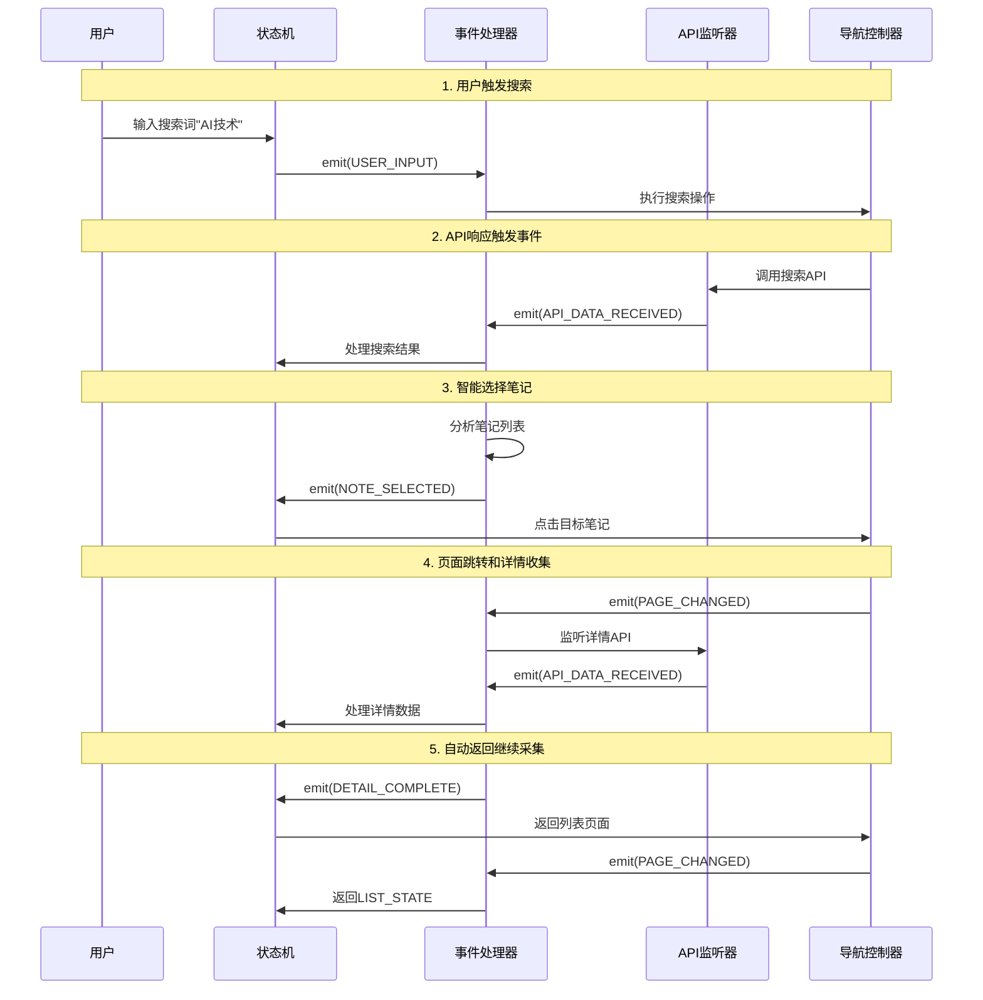

### 3.6 弱心跳监控机制

**健康监控器**：

```python
class HealthMonitor:
    """低频健康监控器 - 不影响主要性能"""

    def __init__(self, state_machine):
        self.state_machine = state_machine
        self.heartbeat_interval = 5.0  # 5秒一次心跳
        self.idle_timeout = 30.0      # 30秒无活动视为异常

    async def monitor_health(self):
        """低频健康检查"""
        while self.state_machine.running:
            await asyncio.sleep(self.heartbeat_interval)

            # 检查是否长时间无活动
            if time.time() - self.state_machine.last_activity > self.idle_timeout:
                await self.handle_idle_timeout()

            # 发送心跳事件（仅监控，不驱动流程）
            await self.state_machine.emit_event("HEALTH_CHECK", {
                "current_state": self.state_machine.current_state,
                "queue_size": self.state_machine.event_queue.qsize(),
                "last_activity": self.state_machine.last_activity
            })
```

### 3.7 错误处理的事件驱动机制

**基于事件的错误处理**：

```python
class ErrorEventHandler:
    """事件驱动的错误处理"""

    async def process_event(self, event, current_state):
        """处理错误事件"""

        if event.type == "API_ERROR":
            error = event.data["error"]
            if self.is_network_error(error):
                await self.handle_network_error(error, current_state)
            elif self.is_auth_error(error):
                await self.handle_auth_error(error, current_state)

        elif event.type == "ERROR_OCCURRED":
            error = event.data["error"]
            error_level = self.analyze_error_level(error)

            if error_level == "minor":
                await self.emit_event("RETRY_OPERATION", {"error": error})
            elif error_level == "moderate":
                await self.emit_event("TRANSITION_TO_SAFE_STATE", {"error": error})
            elif error_level == "critical":
                await self.emit_event("SYSTEM_RESTART", {"error": error})
```

### 3.8 架构优势对比

**两种架构的全面对比**：

| 特性 | 传统心跳驱动 | 事件驱动架构 |
|------|-------------|-------------|
| **CPU使用率** | 高（持续轮询） | 低（阻塞等待） |
| **响应速度** | 延迟（最多0.1秒） | 即时（事件触发） |
| **代码复杂度** | 高（状态检查分散） | 低（逻辑集中） |
| **可扩展性** | 差（难以添加新逻辑） | 优秀（新事件类型） |
| **调试难度** | 高（循环中难追踪） | 低（事件可追溯） |
| **异常检测** | 依赖心跳发现 | 事件+心跳双重保障 |
| **资源消耗** | 持续消耗资源 | 按需消耗资源 |
| **并发处理** | 有限 | 天然支持异步 |

### 3.9 实际运行示例

**事件驱动的实际运行流程**：

```python
# 启动事件驱动的采集系统
async def start_event_driven_collector():
    """启动事件驱动的采集系统"""

    # 1. 初始化状态机和事件系统
    state_machine = EventDrivenStateMachine()

    # 2. 启动三个核心任务
    tasks = [
        state_machine.run(),                    # 主事件处理循环
        monitor_external_events(state_machine), # 监听外部事件
        health_monitor_task(state_machine)      # 健康监控任务
    ]

    # 3. 并发运行所有任务
    await asyncio.gather(*tasks)

# 实际的事件驱动流程
async def actual_collection_flow():
    """实际的事件驱动采集流程"""

    # 用户触发搜索 → 立即响应
    await state_machine.emit_event("USER_INPUT", {
        "type": "search",
        "keyword": "人工智能"
    })

    # 系统立即处理，无等待
    # API响应 → 立即触发事件
    # 数据处理 → 立即选择笔记
    # 页面跳转 → 立即切换状态
    # 采集完成 → 立即返回列表
```

### 3.10 性能优化策略

**事件驱动架构的性能优化**：

1. **事件批处理**：相似事件批量处理，减少上下文切换
2. **优先级队列**：重要事件优先处理
3. **异步I/O**：所有网络操作异步化
4. **内存池**：事件对象复用，减少GC压力
5. **背压控制**：事件队列溢出时的处理策略

这个事件驱动架构实现了真正的**响应式系统**，系统只在有意义的事件发生时才被唤醒，既保证了高响应性，又实现了低资源消耗。

## 4. 事件驱动的模块协作流程

### 4.1 事件驱动的完整工作流程

**事件驱动的采集流程示例**：

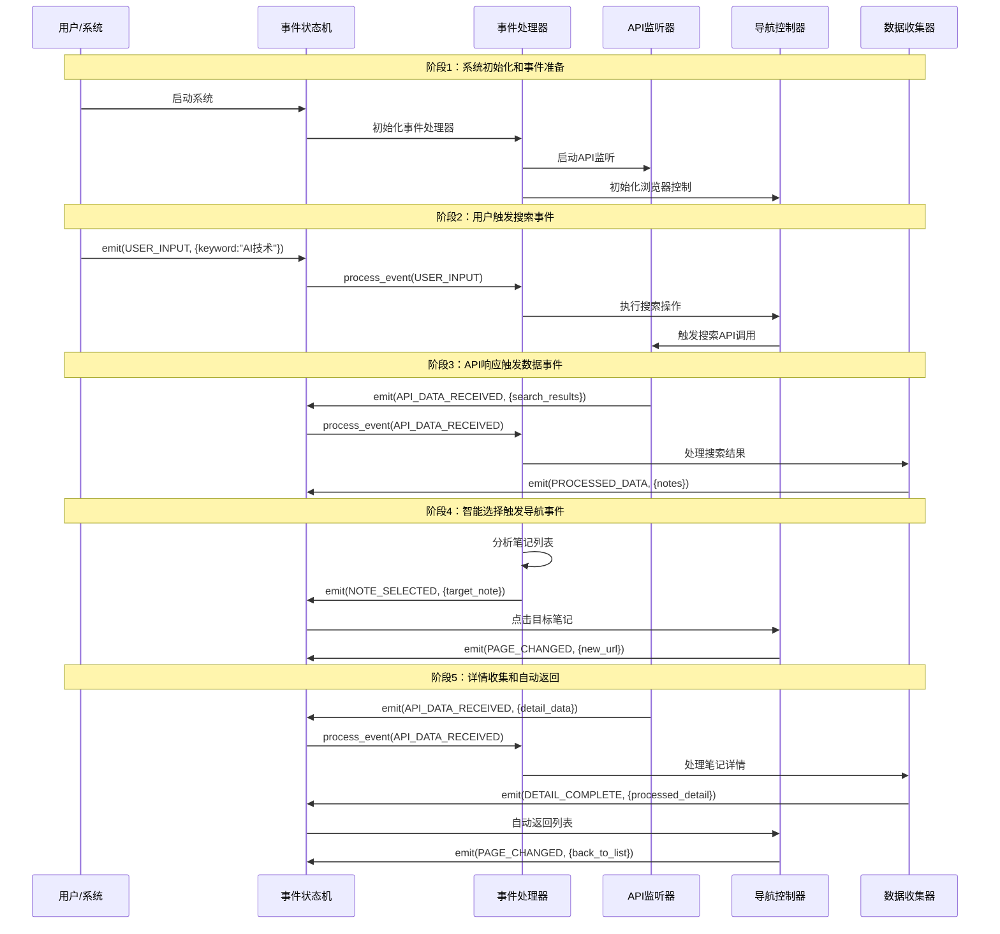

### 4.2 事件生命周期管理

**事件的完整生命周期**：

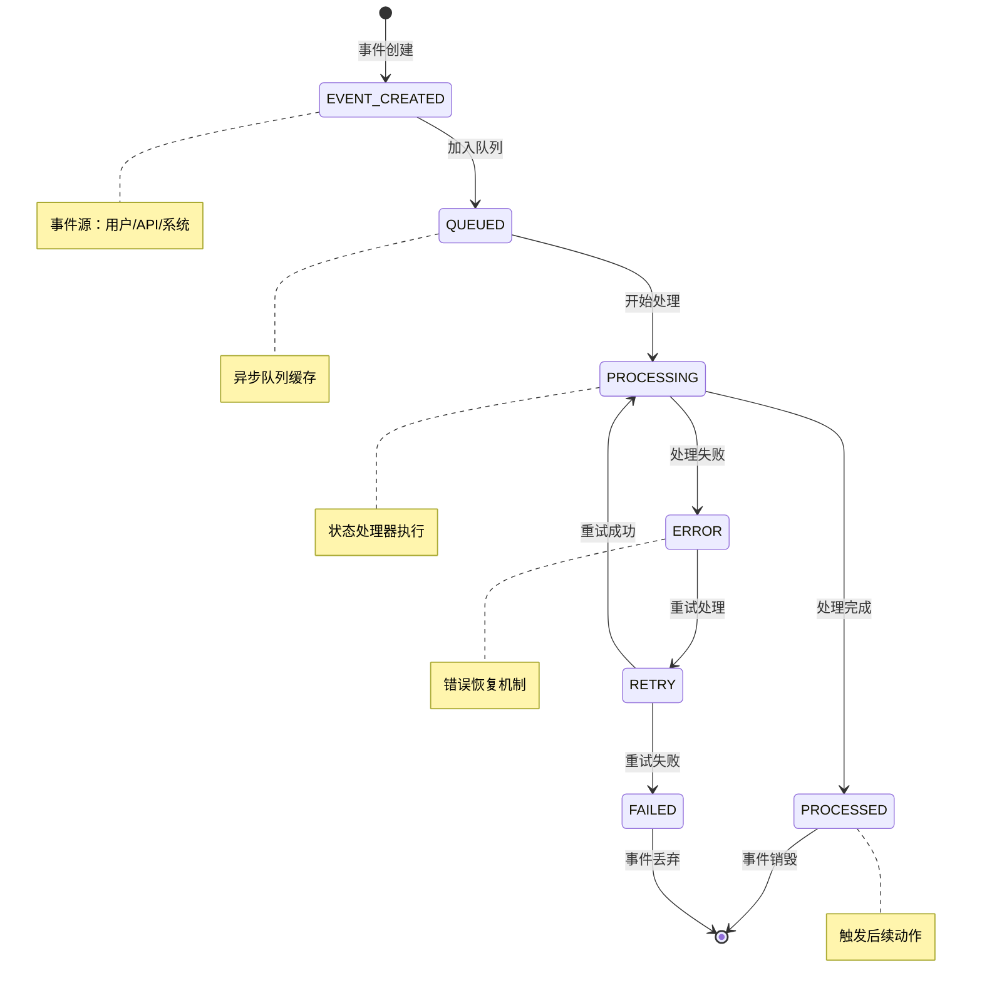

### 4.3 模块间的事件通信协议

**标准化事件通信接口**：

```python
class EventCommunicationProtocol:
    """模块间事件通信的标准协议"""

    def __init__(self):
        self.event_bus = EventBus()
        self.event_handlers = {}
        self.event_filters = {}

    async def subscribe(self, event_type, handler, priority=0):
        """订阅特定类型的事件"""
        subscription = EventSubscription(
            event_type=event_type,
            handler=handler,
            priority=priority
        )
        await self.event_bus.subscribe(subscription)

    async def publish(self, event):
        """发布事件到总线"""
        await self.event_bus.publish(event)

    async def publish_with_response(self, event, timeout=5.0):
        """发布事件并等待响应"""
        response_future = await self.event_bus.publish_with_response(event)
        return await asyncio.wait_for(response_future, timeout=timeout)
```

**模块事件适配器**：

```python
class APIListenerEventAdapter:
    """API监听器的事件适配器"""

    def __init__(self, event_bus):
        self.event_bus = event_bus

    async def on_api_response(self, api_data):
        """API响应时发布事件"""
        await self.event_bus.publish(Event(
            type="API_DATA_RECEIVED",
            data={
                "source": "api_call",
                "api_type": api_data["api_type"],
                "response_data": api_data["response"]
            }
        ))

    async def on_api_error(self, error):
        """API错误时发布事件"""
        await self.event_bus.publish(Event(
            type="API_ERROR",
            data={
                "error_type": error["type"],
                "error_message": error["message"],
                "retry_count": error.get("retry_count", 0)
            }
        ))
```

### 4.4 状态转换的事件驱动机制

**事件驱动的状态转换**：

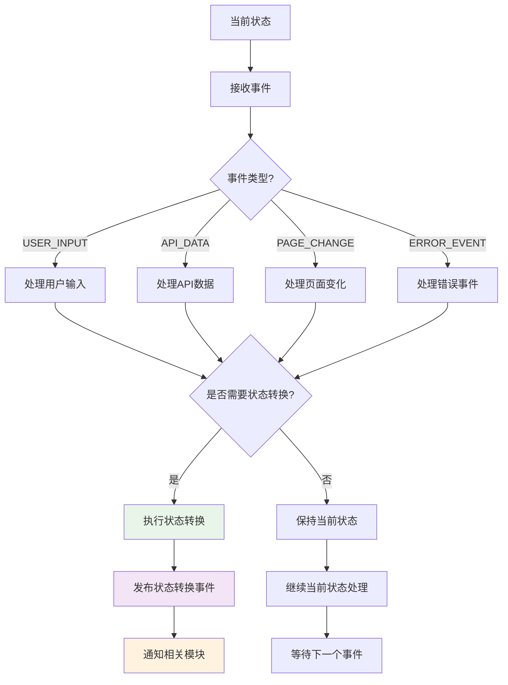

**状态转换事件处理**：

```python
class StateTransitionHandler:
    """状态转换事件处理器"""

    async def handle_transition_event(self, event):
        """处理状态转换事件"""
        transition = event.data["transition"]

        # 发布转换开始事件
        await self.event_bus.publish(Event(
            type="TRANSITION_STARTED",
            data=transition
        ))

        try:
            # 执行状态转换
            await self.execute_transition(transition)

            # 发布转换完成事件
            await self.event_bus.publish(Event(
                type="TRANSITION_COMPLETED",
                data=transition
            ))

        except Exception as e:
            # 发布转换失败事件
            await self.event_bus.publish(Event(
                type="TRANSITION_FAILED",
                data={"transition": transition, "error": str(e)}
            ))
```

### 4.5 事件驱动的数据流管理

**数据流的事件驱动处理**：

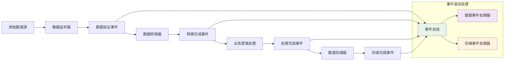

**数据流事件处理器**：

```python
class DataFlowEventHandler:
    """数据流事件处理器"""

    async def handle_data_received(self, event):
        """处理数据接收事件"""
        raw_data = event.data["raw_data"]

        # 数据验证
        validation_result = await self.validate_data(raw_data)
        await self.event_bus.publish(Event(
            type="DATA_VALIDATED",
            data={"result": validation_result, "original": raw_data}
        ))

        if validation_result.is_valid:
            # 数据转换
            converted_data = await self.convert_data(raw_data)
            await self.event_bus.publish(Event(
                type="DATA_CONVERTED",
                data=converted_data
            ))

    async def handle_data_converted(self, event):
        """处理数据转换完成事件"""
        converted_data = event.data

        # 业务逻辑处理
        processed_data = await self.process_business_logic(converted_data)
        await self.event_bus.publish(Event(
            type="DATA_PROCESSED",
            data=processed_data
        ))
```

### 4.6 错误处理和恢复机制

**事件驱动的错误处理流程**：

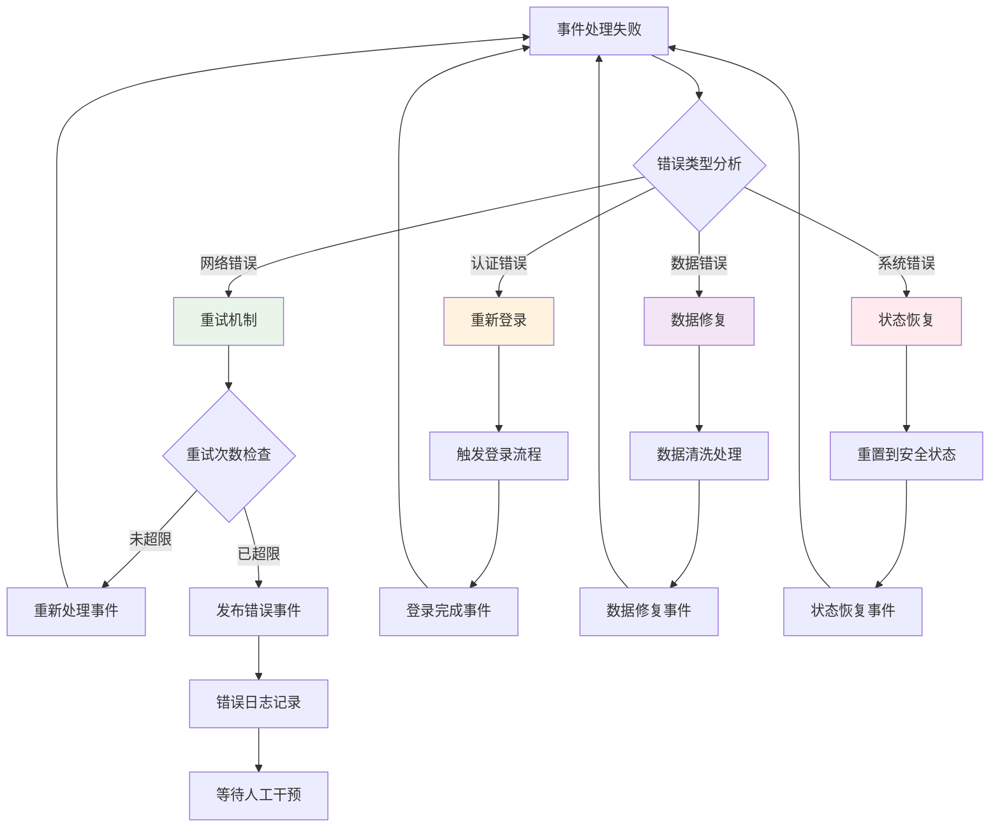

### 4.7 性能监控和优化

**事件驱动的性能监控**：

```python
class EventPerformanceMonitor:
    """事件性能监控器"""

    def __init__(self):
        self.event_metrics = {}
        self.performance_thresholds = {
            "processing_time": 1.0,  # 秒
            "queue_size": 1000,      # 事件数
            "error_rate": 0.05       # 5%
        }

    async def monitor_event_processing(self, event):
        """监控事件处理性能"""
        start_time = time.time()

        try:
            # 处理事件
            result = await self.process_event(event)

            # 记录成功指标
            processing_time = time.time() - start_time
            self.record_metrics(event.type, processing_time, success=True)

            return result

        except Exception as e:
            # 记录失败指标
            processing_time = time.time() - start_time
            self.record_metrics(event.type, processing_time, success=False, error=e)

            # 性能告警
            if self.is_performance_degraded(event.type):
                await self.send_performance_alert(event.type, processing_time)
```

### 4.8 模块协作的最佳实践

**事件驱动架构的最佳实践**：

1. **事件命名规范**：
   - 使用清晰的动词-名词格式：`USER_CLICKED_NOTE`
   - 避免歧义：使用`SEARCH_COMPLETED`而非`DATA_READY`

2. **事件数据结构**：
   - 标准化事件数据格式
   - 包含必要的元数据（时间戳、来源、优先级）

3. **错误处理策略**：
   - 事件处理失败时的重试机制
   - 死信队列处理无法恢复的事件

4. **性能优化**：
   - 事件批处理减少上下文切换
   - 优先级队列确保重要事件优先处理

5. **监控和调试**：
   - 完整的事件追踪链路
   - 事件处理的性能指标监控

这个事件驱动的协作流程实现了真正**响应式系统**，各模块通过事件总线松耦合地协作，既保证了系统的灵活性，又实现了高性能和低延迟。

## 5. 智能Agent的事件驱动集成

### 5.1 Agent与事件系统的融合

**AI Agent作为特殊的事件处理器**：

```python
class SmartAgentEventHandler:
    """智能Agent事件处理器"""

    def __init__(self, llm_client, user_config):
        self.llm_client = llm_client
        self.user_config = user_config
        self.decision_threshold = user_config.decision_threshold or 0.8

    async def handle_event(self, event, current_state):
        """处理事件并进行智能决策"""

        if event.type == "SEARCH_COMPLETED":
            # 分析搜索结果
            analysis_result = await self.analyze_search_results(event.data["notes"])
            decision = await self.make_selection_decision(event.data["notes"], analysis_result)

            if decision.confidence >= self.decision_threshold:
                # 高置信度，自动选择
                await self.emit_event("AUTO_NOTE_SELECTED", {
                    "note": decision.selected_note,
                    "confidence": decision.confidence,
                    "reasoning": decision.reasoning
                })
            else:
                # 低置信度，请求用户确认
                await self.emit_event("REQUEST_USER_CONFIRMATION", {
                    "recommended_note": decision.selected_note,
                    "alternatives": decision.alternatives,
                    "confidence": decision.confidence
                })

        elif event.type == "USER_CONFIRMATION":
            # 处理用户确认结果
            if event.data["confirmed"]:
                await self.emit_event("USER_CONFIRMED_NOTE", {
                    "note": event.data["selected_note"]
                })
            else:
                await self.emit_event("USER_REJECTED_SELECTION", {})

        return current_state
```

### 5.2 事件驱动的智能决策流程

**Agent决策的事件驱动流程**：

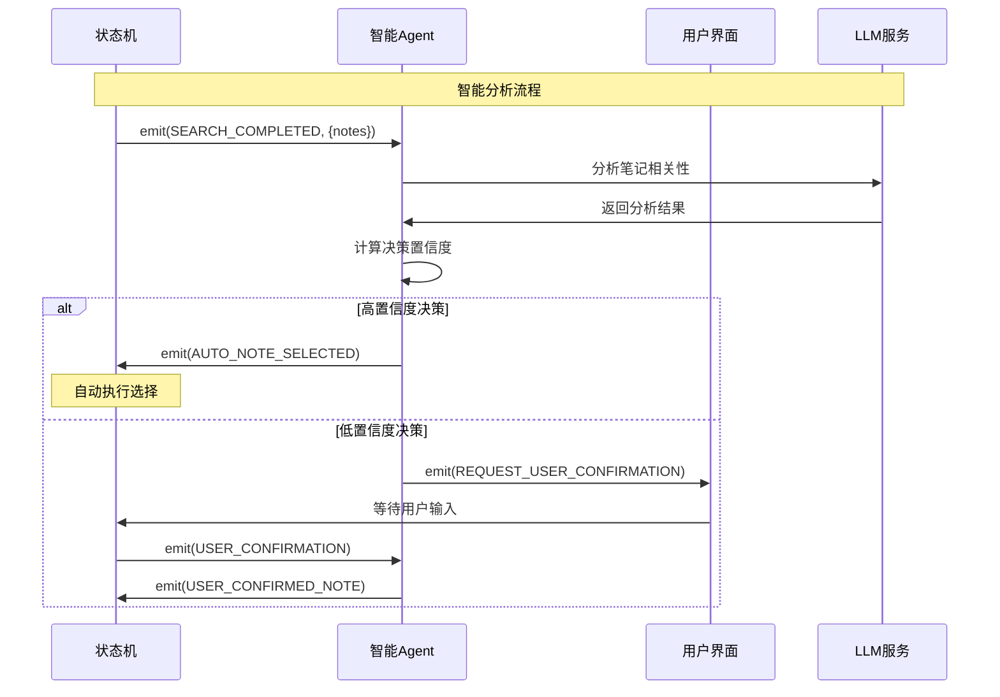

## 6. 数据流转的事件驱动架构

### 6.1 数据流的事件驱动处理

**完整的数据事件处理链**：

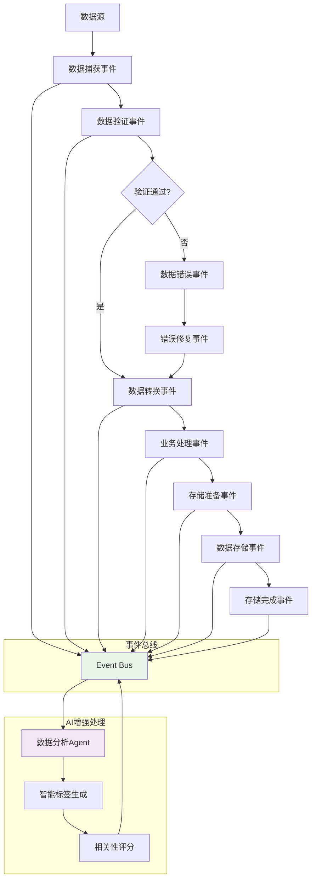

### 6.2 事件驱动的数据质量保证

**数据质量监控的事件处理**：

```python
class DataQualityEventHandler:
    """数据质量监控事件处理器"""

    async def handle_event(self, event, current_state):
        """处理数据质量相关事件"""

        if event.type == "DATA_RECEIVED":
            # 数据质量检查
            quality_score = await self.assess_data_quality(event.data)

            if quality_score < 0.8:
                await self.emit_event("DATA_QUALITY_ISSUE", {
                    "data": event.data,
                    "quality_score": quality_score,
                    "issues": self.identify_quality_issues(event.data)
                })
            else:
                await self.emit_event("DATA_QUALITY_PASSED", {
                    "data": event.data,
                    "quality_score": quality_score
                })

        elif event.type == "DATA_QUALITY_ISSUE":
            # 自动修复数据质量问题
            repaired_data = await self.auto_repair_data(event.data)
            await self.emit_event("DATA_REPAIRED", repaired_data)

        return current_state
```

## 7. 扩展性和维护性

### 7.1 事件驱动的扩展能力

**基于事件的系统扩展**：

```python
# 扩展新的事件类型
EXTENDED_EVENT_TYPES = {
    # 新的业务事件
    "FOLLOW_AUTHOR": "关注作者事件",
    "COLLECT_NOTE": "收藏笔记事件",
    "SHARE_CONTENT": "分享内容事件",

    # 新的系统事件
    "PERFORMANCE_ALERT": "性能告警事件",
    "SECURITY_THREAT": "安全威胁事件",
    "USER_PREFERENCE_CHANGE": "用户偏好变化事件"
}

# 扩展新的事件处理器
class ExtendedEventHandler:
    """扩展的事件处理器"""

    async def handle_follow_author_event(self, event):
        """处理关注作者事件"""
        author_id = event.data["author_id"]
        # 执行关注逻辑
        await self.follow_author(author_id)

    async def handle_collect_note_event(self, event):
        """处理收藏笔记事件"""
        note_id = event.data["note_id"]
        collection_id = event.data["collection_id"]
        # 执行收藏逻辑
        await self.collect_note(note_id, collection_id)
```

### 7.2 模块替换的事件兼容性

**事件驱动的模块替换策略**：

```python
class ModuleReplacementManager:
    """模块替换管理器"""

    async def replace_module(self, old_module, new_module):
        """替换模块并保持事件兼容性"""

        # 1. 停止旧模块的事件订阅
        await self.event_bus.unsubscribe_all(old_module)

        # 2. 迁移事件处理配置
        event_mappings = old_module.get_event_mappings()
        new_module.configure_event_mappings(event_mappings)

        # 3. 重新订阅事件
        for event_type, handler in new_module.get_event_handlers().items():
            await self.event_bus.subscribe(event_type, handler)

        # 4. 发布模块替换事件
        await self.event_bus.publish(Event(
            type="MODULE_REPLACED",
            data={
                "old_module": old_module.__class__.__name__,
                "new_module": new_module.__class__.__name__
            }
        ))
```

## 8. 开发和调试策略

### 8.1 事件驱动系统的调试

**事件追踪和调试工具**：

```python
class EventDebugger:
    """事件调试器"""

    def __init__(self, event_bus):
        self.event_bus = event_bus
        self.event_trace = []
        self.debug_mode = False

    async def start_debugging(self):
        """开始事件调试"""
        self.debug_mode = True
        await self.event_bus.subscribe("*", self.debug_event_handler)

    async def debug_event_handler(self, event):
        """调试事件处理"""
        if self.debug_mode:
            trace_entry = {
                "timestamp": time.time(),
                "event_type": event.type,
                "event_data": event.data,
                "stack_trace": traceback.format_stack()
            }
            self.event_trace.append(trace_entry)

            # 实时输出调试信息
            print(f"[DEBUG] Event: {event.type}, Data: {event.data}")

    def get_event_trace(self):
        """获取事件追踪记录"""
        return self.event_trace

    def export_trace_log(self, filename):
        """导出追踪日志"""
        with open(filename, 'w') as f:
            json.dump(self.event_trace, f, indent=2)
```

### 8.2 性能优化的事件策略

**事件系统性能优化**：

```python
class EventPerformanceOptimizer:
    """事件性能优化器"""

    def __init__(self):
        self.event_pools = {}
        self.batch_processors = {}
        self.priority_queues = {}

    async def optimize_event_processing(self, events):
        """优化事件处理"""

        # 1. 事件批处理
        batched_events = self.batch_similar_events(events)

        # 2. 优先级处理
        prioritized_events = self.sort_by_priority(batched_events)

        # 3. 并行处理
        tasks = []
        for event_group in prioritized_events:
            task = asyncio.create_task(self.process_event_group(event_group))
            tasks.append(task)

        # 4. 等待所有任务完成
        results = await asyncio.gather(*tasks, return_exceptions=True)

        return results
```

## 9. 最佳实践建议

### 9.1 事件驱动架构设计原则

**核心设计原则**：

1. **单一职责**：每个事件处理器只处理特定类型的事件
2. **松耦合**：模块间通过事件通信，避免直接依赖
3. **高内聚**：相关的事件处理逻辑集中在同一模块
4. **可观测性**：完整的事件追踪和监控机制
5. **容错性**：事件处理失败时的恢复和重试机制

### 9.2 事件命名和数据结构规范

**标准化规范**：

```python
# 事件命名规范
EVENT_NAMING_CONVENTIONS = {
    "USER_INTERACTIONS": "USER_{ACTION}_{TARGET}",  # USER_CLICK_NOTE
    "API_OPERATIONS": "API_{OPERATION}_{RESULT}",  # API_CALL_SUCCESS
    "STATE_CHANGES": "STATE_{FROM}_TO_{TO}",         # STATE_LIST_TO_DETAIL
    "DATA_OPERATIONS": "DATA_{OPERATION}_{TYPE}",   # DATA_PROCESSED_NOTE
    "SYSTEM_EVENTS": "SYSTEM_{COMPONENT}_{STATUS}"   # SYSTEM_BROWSER_READY
}

# 事件数据结构标准
EVENT_DATA_SCHEMA = {
    "metadata": {
        "timestamp": "float",
        "source": "string",
        "event_id": "string",
        "correlation_id": "string"
    },
    "payload": {
        "type": "object",
        "required": ["data"]
    }
}
```

### 9.3 监控和告警策略

**事件系统的监控指标**：

```python
class EventSystemMonitor:
    """事件系统监控器"""

    MONITORING_METRICS = {
        "event_throughput": "事件处理吞吐量",
        "processing_latency": "事件处理延迟",
        "error_rate": "错误率",
        "queue_depth": "事件队列深度",
        "handler_performance": "处理器性能",
        "system_health": "系统健康状态"
    }

    async def collect_metrics(self):
        """收集监控指标"""
        metrics = {}

        for metric_name, description in self.MONITORING_METRICS.items():
            metric_value = await self.get_metric_value(metric_name)
            metrics[metric_name] = {
                "value": metric_value,
                "description": description,
                "timestamp": time.time()
            }

        return metrics
```

## 总结

这个**事件驱动架构**的核心价值在于：

### 技术优势

1. **高性能**：零CPU空转，按需响应
2. **低延迟**：事件触发立即处理
3. **高并发**：天然支持异步并发
4. **易扩展**：新功能通过事件类型轻松扩展
5. **强容错**：事件隔离，单点故障不影响全局

### 业务价值

1. **实时响应**：用户操作立即得到反馈
2. **智能决策**：AI Agent基于事件进行智能分析
3. **数据质量**：事件驱动的数据质量保证
4. **可观测性**：完整的事件追踪和监控
5. **灵活配置**：通过事件实现动态配置

### 架构演进

从传统的**心跳驱动轮询模式**演进到现代化的**事件驱动响应模式**，实现了：

- **从主动轮询到被动响应**：系统状态变化自动通知
- **从同步阻塞到异步非阻塞**：大幅提升并发能力
- **从紧耦合到松耦合**：模块间通过事件解耦
- **从静态配置到动态响应**：运行时动态调整行为

这个事件驱动架构为小红书笔记采集系统提供了**企业级的响应式解决方案**，既保证了系统的性能和稳定性，又为未来的功能扩展和智能化升级奠定了坚实基础。