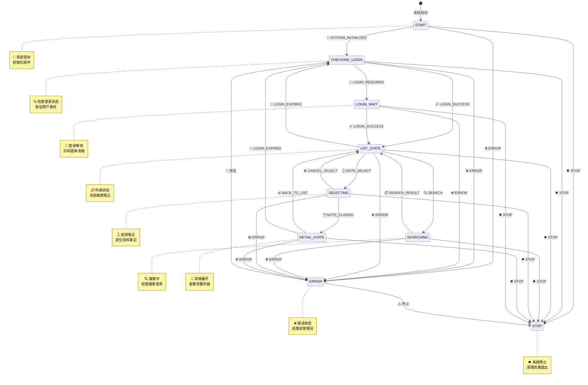
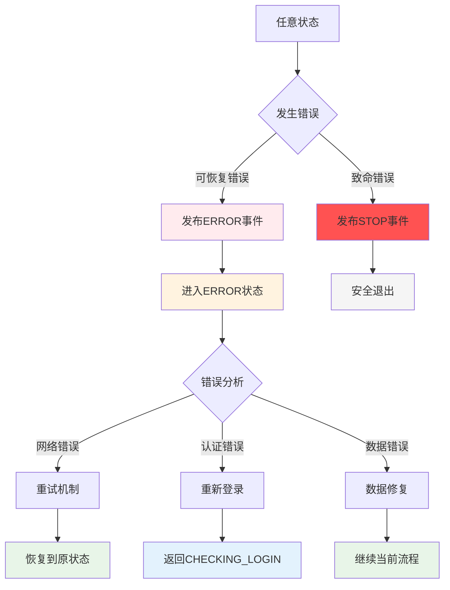

# 事件驱动的状态流转设计

## 概述

本文档描述小红书笔记采集系统中事件与状态转换的关系，以及事件如何驱动状态机流转。

## 核心设计理念

**事件驱动状态转换**：每个事件都明确对应一个或多个状态转换，事件是状态流转的唯一触发器。

## 完整状态流转图

### 主业务流程



## 事件与状态转换详细映射

### 1. 系统初始化事件

| 事件类型 | 源状态 | 目标状态 | 代码位置 | 触发条件 |
|---------|--------|----------|----------|----------|
| `SYSTEM_INITIALIZED` | `START` | `CHECKING_LOGIN` | [`EventType.SYSTEM_INITIALIZED`](../core/state_types.py:110) | 系统初始化完成 |

### 2. 登录相关事件

| 事件类型 | 源状态 | 目标状态 | 代码位置 | 触发条件 |
|---------|--------|----------|----------|----------|
| `LOGIN_REQUIRED` | `CHECKING_LOGIN` | `LOGIN_WAIT` | [`EventType.LOGIN_REQUIRED`](../core/state_types.py:113) | 检测到未登录 |
| `LOGIN_SUCCESS` | `CHECKING_LOGIN` | `LIST_STATE` | [`EventType.LOGIN_SUCCESS`](../core/state_types.py:114) | 验证已登录 |
| `LOGIN_SUCCESS` | `LOGIN_WAIT` | `LIST_STATE` | [`EventType.LOGIN_SUCCESS`](../core/state_types.py:114) | 扫码登录成功 |

### 3. 核心业务事件

| 事件类型 | 源状态 | 目标状态 | 代码位置 | 业务场景 |
|---------|--------|----------|----------|----------|
| `SEARCH` | `LIST_STATE` | `SEARCHING` | [`EventType.SEARCH`](../core/state_types.py:114) | 用户输入搜索关键词 |
| `SEARCH_RESULT` | `SEARCHING` | `LIST_STATE` | [`EventType.SEARCH_RESULT`](../core/state_types.py:115) | 搜索结果返回 |
| `NOTE_SELECT` | `LIST_STATE` | `SELECTING` | [`EventType.NOTE_SELECT`](../core/state_types.py:118) | 用户选择笔记 |
| `NOTE_CLICKED` | `SELECTING` | `DETAIL_STATE` | [`EventType.NOTE_CLICKED`](../core/state_types.py:119) | 成功点击笔记 |
| `CANCEL_SELECT` | `SELECTING` | `LIST_STATE` | [`EventType.CANCEL_SELECT`](../core/state_types.py:120) | 用户取消选择 |
| `BACK_TO_LIST` | `DETAIL_STATE` | `LIST_STATE` | [`EventType.BACK_TO_LIST`](../core/state_types.py:124) | 用户返回列表 |

### 4. 系统事件

| 事件类型 | 源状态 | 目标状态 | 代码位置 | 处理逻辑 |
|---------|--------|----------|----------|----------|
| `LOGIN_EXPIRED` | `LIST_STATE` | `CHECKING_LOGIN` | [`EventType.LOGIN_EXPIRED`](../core/state_types.py:127) | 登录状态过期 |
| `LOGIN_EXPIRED` | `DETAIL_STATE` | `CHECKING_LOGIN` | [`EventType.LOGIN_EXPIRED`](../core/state_types.py:127) | 访问详情时发现未登录 |
| `ERROR` | 任意状态 | `ERROR` | [`EventType.ERROR`](../core/state_types.py:128) | 系统发生错误 |
| `STOP` | 任意状态 | `STOP` | [`EventType.STOP`](../core/state_types.py:129) | 用户停止或系统终止 |

## 事件工厂使用示例

### 登录流程事件

```python
from core.state_types import EventFactory

# 检测到需要登录
login_event = EventFactory.login_required()
# Event(type="login_required", data={"timestamp": 1699999999.0})

# 登录成功
success_event = EventFactory.login_success()
# Event(type="login_success", data={"timestamp": 1699999999.0})
```

### 搜索流程事件

```python
# 开始搜索
search_event = EventFactory.search("人工智能")
# Event(type="search", data={"keyword": "人工智能", "timestamp": 1699999999.0})

# 搜索结果返回
result_event = EventFactory.search_result([note1, note2, note3])
# Event(type="search_result", data={"notes": [...], "timestamp": 1699999999.0})
```

### 笔记选择事件

```python
# 选择笔记
select_event = EventFactory.note_select("note_123")
# Event(type="note_select", data={"note_id": "note_123", "timestamp": 1699999999.0})

# 成功点击笔记
click_event = EventFactory.note_clicked("note_123")
# Event(type="note_clicked", data={"note_id": "note_123", "timestamp": 1699999999.0})

# 取消选择
cancel_event = EventFactory.cancel_select()
# Event(type="cancel_select", data={"timestamp": 1699999999.0})
```

## 状态机处理逻辑

### 事件驱动状态转换示例

```python
class StateMachine:
    def __init__(self):
        self.current_state = BusinessState.CHECKING_LOGIN
        self.event_queue = asyncio.Queue()

    async def handle_event(self, event: Event):
        """处理事件并执行状态转换"""

        # 根据当前状态和事件类型决定转换
        if self.current_state == BusinessState.CHECKING_LOGIN:
            if event.type == EventType.LOGIN_REQUIRED:
                await self.transition_to(BusinessState.LOGIN_WAIT)
            elif event.type == EventType.LOGIN_SUCCESS:
                await self.transition_to(BusinessState.LIST_STATE)

        elif self.current_state == BusinessState.LIST_STATE:
            if event.type == EventType.SEARCH:
                await self.transition_to(BusinessState.SEARCHING)
            elif event.type == EventType.NOTE_SELECT:
                await self.transition_to(BusinessState.SELECTING)
            elif event.type == EventType.LOGIN_EXPIRED:
                await self.transition_to(BusinessState.CHECKING_LOGIN)

        elif self.current_state == BusinessState.SEARCHING:
            if event.type == EventType.SEARCH_RESULT:
                await self.transition_to(BusinessState.LIST_STATE)

        # ... 其他状态处理逻辑
```

## 异常处理流程

### 错误恢复机制



## 最佳实践

### 1. 事件命名规范

- 使用动词-名词格式：`NOTE_SELECT`, `SEARCH_RESULT`
- 事件类型对应具体的业务动作
- 避免歧义，清晰表达意图

### 2. 状态转换原则

- 每个事件都要明确对应状态转换
- 避免隐式状态转换
- 状态转换要原子性

### 5. 事件数据设计

- 事件数据包含处理所需的最小信息
- 避免在事件中传递大量数据
- 使用引用而非完整对象

## 代码文件关联

| 组件 | 文件路径 | 主要内容 |
|------|----------|----------|
| 状态枚举 | [`core/state_types.py:11-104`](../core/state_types.py:11) | BusinessState定义和转换规则 |
| 事件类型 | [`core/state_types.py:106-130`](../core/state_types.py:106) | EventType事件类型定义 |
| 事件模型 | [`core/state_types.py:132-141`](../core/state_types.py:132) | Event事件数据模型 |
| 事件工厂 | [`core/state_types.py:144-206`](../core/state_types.py:144) | EventFactory事件创建方法 |

## 扩展指南

### 添加新事件类型

1. 在 [`EventType`](../core/state_types.py:106) 中添加新常量
2. 在 [`EventFactory`](../core/state_types.py:144) 中添加对应的工厂方法
3. 更新状态转换规则 [`can_transition_to`](../core/state_types.py:47)
4. 更新本文档的事件映射表

### 添加新业务状态

1. 在 [`BusinessState`](../core/state_types.py:11) 中添加新状态
2. 更新状态转换规则
3. 定义触发该状态的事件类型
4. 更新状态流转图

---

> **注意**：本文档与代码保持同步，任何修改都应同时更新代码和文档。